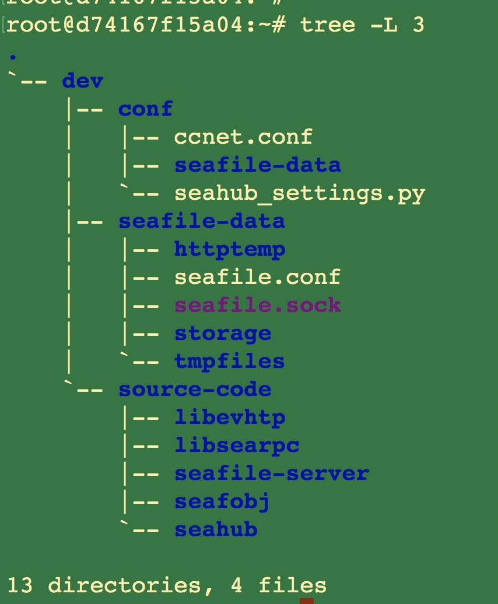

This is the document for deploying Seafile open source development environment in Ubuntu 1804 docker container.

## Run a container

```
docker run -it -p 8000:8000 -p 8082:8082 -p 3000:3000 --name seafile-ce-env ubuntu:18.04  bash
```

Note, the following commands are all executed in the seafile-ce-env docker container.

## Update Source and Install Dependencies.

```
apt-get update && apt-get upgrade -y

apt-get install -y ssh libevent-dev libcurl4-openssl-dev libglib2.0-dev uuid-dev intltool libsqlite3-dev libmysqlclient-dev libarchive-dev libtool libjansson-dev valac libfuse-dev python-dateutil cmake re2c flex sqlite3 python-pip python-simplejson git libssl-dev libldap2-dev libonig-dev vim vim-scripts wget cmake gcc autoconf automake mysql-client librados-dev libxml2-dev curl sudo telnet netcat unzip netbase ca-certificates apt-transport-https build-essential libxslt1-dev libffi-dev libpcre3-dev libz-dev xz-utils nginx pkg-config poppler-utils libmemcached-dev sudo

curl -sL https://deb.nodesource.com/setup_10.x | sudo -E bash -
apt-get install -y nodejs

apt-get install -y python3-pip python3.6 python3.6-dev

python3.6 -m pip install --upgrade pip

rm /usr/bin/python
rm /usr/bin/python3
ln -s /usr/bin/python3.6 /usr/bin/python
ln -s /usr/bin/python3.6 /usr/bin/python3

rm /usr/bin/pip
rm /usr/bin/pip3
ln -s /usr/local/bin/pip3.6 /usr/bin/pip
ln -s /usr/local/bin/pip3.6 /usr/bin/pip3

pip install python-cas djangosaml2 cffi sqlalchemy pymysql pillow pycryptodome configparser pylibmc django-pylibmc elasticsearch==5.5.0 elasticsearch-dsl==5.4.0 Django==2.2.14 future captcha django-statici18n django-post_office==3.3.0 django-webpack_loader gunicorn mysqlclient django-picklefield==2.1.1 openpyxl qrcode django-formtools django-simple-captcha djangorestframework==3.11.1 python-dateutil requests pillow pyjwt pycryptodome requests_oauthlib mock nose exam splinter pytest pytest-django
```

## Install MariaDB and Create Databases

```
apt-get install -y mariadb-server
service mysql start
mysqladmin -u root password 123456
```

sql for create databases

```
create database ccnet charset utf8;
create database seafile charset utf8;
create database seahub charset utf8;
```

## Download Source Code

```
cd ~/
mkdir -p ~/dev/source-code
cd ~/dev/source-code

git clone https://github.com/haiwen/libevhtp.git
git clone https://github.com/haiwen/libsearpc.git
git clone https://github.com/haiwen/seafile-server.git
git clone https://github.com/haiwen/seahub.git

cd libsearpc/
git fetch origin 8.0:8.0
git checkout 8.0

cd ../seafile-server
git checkout tags/v8.0.0-server -b tag-v8.0.0-server

cd ../seahub
git checkout tags/v8.0.0-server -b tag-v8.0.0-server
```

## Compile and Install seaf-server

```
cd ../libevhtp
cmake -DEVHTP_DISABLE_SSL=ON -DEVHTP_BUILD_SHARED=OFF .
make
make install
ldconfig

cd ../libsearpc
./autogen.sh
./configure
make
make install
ldconfig

cd ../seafile-server
./autogen.sh
./configure --disable-fuse
make
make install
ldconfig
```

## Create Conf Files

```
mkdir ~/dev/conf
cd ~/dev/conf

cat > ccnet.conf  <<EOF
[Database]
ENGINE = mysql
HOST = localhost
PORT = 3306
USER = root
PASSWD = 123456
DB = ccnet
CONNECTION_CHARSET = utf8
CREATE_TABLES = true

[General]
SERVICE_URL = http://127.0.0.1:8000
EOF

cat > seahub_settings.py  <<EOF
DATABASES = {
    'default': {
        'ENGINE': 'django.db.backends.mysql',
        'NAME': 'seahub',
        'USER': 'root',
        'PASSWORD': '123456',
        'HOST': 'localhost',
        'PORT': '3306',
    }
}
FILE_SERVER_ROOT = 'http://127.0.0.1:8082'
EOF


mkdir ~/dev/seafile-data
cd ~/dev/seafile-data

cat > seafile.conf  <<EOF
[database]
type = mysql
host = localhost
port = 3306
user = root
password = 123456
db_name = seafile
connection_charset = utf8
create_tables = true
EOF
```

## Start seaf-server

```
seaf-server -c /root/dev/conf -d /root/dev/seafile-data -D all -f -l - &
```

## Start seahub

### Prepare environment variables

```
cd ~/dev/source-code/seahub/

export PYTHONPATH=/usr/local/lib/python3.6/site-packages/:/root/dev/source-code/seahub/thirdpart:$PYTHONPATH
export CCNET_CONF_DIR=/root/dev/conf
export SEAFILE_CONF_DIR=/root/dev/seafile-data
export SEAFILE_CENTRAL_CONF_DIR=/root/dev/conf
```

### Create seahub database tables

```
python manage.py migrate
```

### Create user

```
python manage.py createsuperuser
```

### Start seahub

```
python manage.py runserver 0.0.0.0:8000
```

Then, you can visit <http://127.0.0.1:8000/>  to use Seafile.

## The Final Directory Structure



## More

### Deploy Frontend Development Environment

For deploying frontend development enviroment, you need:

1, checkout seahub to master branch

```
cd /root/dev/source-code/seahub

git fetch origin master:master
git checkout master
```

2, add the following configration to /root/dev/conf/seahub_settings.py

```
import os
PROJECT_ROOT = '/root/dev/source-code/seahub'
WEBPACK_LOADER = {
    'DEFAULT': {
        'BUNDLE_DIR_NAME': 'frontend/',
        'STATS_FILE': os.path.join(PROJECT_ROOT,
                                   'frontend/webpack-stats.dev.json'),
    }
}
DEBUG = True
```

3, install js modules

```
cd /root/dev/source-code/seahub/frontend

npm install
```

4, npm run dev

```
cd /root/dev/source-code/seahub/frontend

npm run dev
```

5, start seaf-server and seahub
