# SAML 2.0 in version 10.0+

In this document, we demonstrate how to integrate Seafile with SAML single sign-on. We will use the Microsoft Azure SAML single sign-on app, Microsoft on-premise ADFS, and Keycloak as three examples. Other SAML 2.0 providers should follow a similar approach.

## Preparations for SAML 2.0

### Install xmlsec1 package (binary deployment only)

!!! note "This step is not needed for Docker based deployment"


```
$ apt update
$ apt install xmlsec1
$ apt install dnsutils  # For multi-tenancy feature
```

### Prepare SP(Seafile) certificate directory and SP certificates:

Create certs dir：

=== "Docker Deployment"
    The default deployment path for Seafile is **/opt/seafile**, and the corresponding default path for seafile-data is **/opt/seafile-data**. If you do not deploy Seafile to this directory, you can check the **SEAFILE_VOLUME** variable in the env to confirm the path of your seafile-data.
    ```sh
    cd /opt/seafile-data/seafile/seahub-data
    mkdir certs
    ```

=== "Binary Deployment"
    If you deploy Seafile using the binary package, the default installation and data path is **/opt/seafile**. If you do not deploy Seafile to this directory, please check your actual deployment path.
    ```sh
    cd /opt/seafile/seahub-data
    mkdir certs
    ```

The SP certificate can be generated by the openssl command, or you can apply to the certificate manufacturer, it is up to you. For example, generate the SP certs using the following command:

```sh
cd certs
openssl req -x509 -nodes -days 3650 -newkey rsa:2048 -keyout sp.key -out sp.crt
```

!!! tip "The `days` option indicates the validity period of the generated certificate. The unit is day. The system admin needs to update the certificate regularly"


## Integrate with Identity Provider

### Example 1: Microsoft Azure SAML single sign-on app

If you use Microsoft Azure SAML app to achieve single sign-on, please follow the steps below:

**First**, add SAML single sign-on app and assign users, refer to: [add an Azure AD SAML application](https://docs.microsoft.com/en-us/azure/active-directory/manage-apps/add-application-portal), [create and assign users](https://docs.microsoft.com/en-us/azure/active-directory/manage-apps/add-application-portal-assign-users).

**Second**, setup the _Identifier_, _Reply URL_, and _Sign on URL_ of the SAML app based on your service URL, refer to: [enable single sign-on for saml app](https://learn.microsoft.com/en-us/azure/active-directory/manage-apps/add-application-portal-setup-sso). The format of the _Identifier_, _Reply URL_, and _Sign on URL_ are: https://example.com/saml2/metadata/, https://example.com/saml2/acs/, https://example.com/, e.g.:


**Next**, [edit saml attributes & claims](https://learn.microsoft.com/en-us/azure/active-directory/develop/saml-claims-customization). Keep the default attributes & claims of SAML app unchanged, the _uid_ attribute must be added, the _mail_ and _name_ attributes are optional, e.g.:

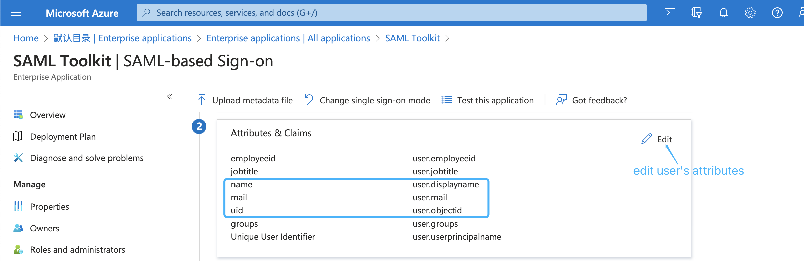

**Next**, download the base64 format SAML app's certificate and rename to idp.crt:


and put it under the certs directory(`/opt/seafile/seahub-data/certs`).

**Next**, copy the metadata URL of the SAML app:

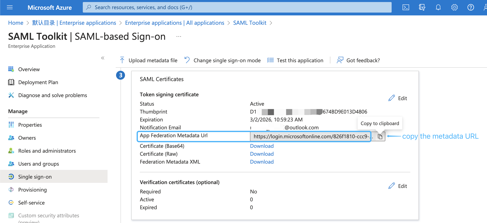

and paste it into the `SAML_REMOTE_METADATA_URL` option in seahub_settings.py, e.g.:

```python
SAML_REMOTE_METADATA_URL = 'https://login.microsoftonline.com/xxx/federationmetadata/2007-06/federationmetadata.xml?appid=xxx'   # copy from SAML app
```

**Next**, add `ENABLE_ADFS_LOGIN`, `LOGIN_REDIRECT_URL` and `SAML_ATTRIBUTE_MAPPING` options to seahub_settings.py, and then restart Seafile, e.g:

```python
ENABLE_ADFS_LOGIN = True
LOGIN_REDIRECT_URL = '/saml2/complete/'
SAML_ATTRIBUTE_MAPPING = {
    'name': ('display_name', ),
    'mail': ('contact_email', ),
    'seafile_groups': ('', ), # Optional, set this attribute if you need to synchronize groups/departments.
    ...
    
}
SAML_REMOTE_METADATA_URL = 'https://login.microsoftonline.com/xxx/federationmetadata/2007-06/federationmetadata.xml?appid=xxx'   # copy from SAML app
```

!!! note
    - If the xmlsec1 binary is **not located in** `/usr/bin/xmlsec1`, you need to add the following configuration in seahub_settings.py:

    ```python
    SAML_XMLSEC_BINARY_PATH = '/path/to/xmlsec1'
    ```

    View where the xmlsec1 binary is located:

    ```
    $ which xmlsec1
    ```

    - If certificates are **not placed in** `/opt/seafile/seahub-data/certs`, you need to add the following configuration in seahub_settings.py:

    ```python
    SAML_CERTS_DIR = '/path/to/certs'
    ```

**Finally**, open the browser and enter the Seafile login page, click `Single Sign-On`, and use the user assigned to SAML app to perform a SAML login test.

### Example 2: On-premise ADFS

If you use Microsoft ADFS to achieve single sign-on, please follow the steps below:

**First**, please make sure the following preparations are done:

1. A Windows Server with [ADFS](https://learn.microsoft.com/en-us/windows-server/identity/active-directory-federation-services) installed. For configuring and installing ADFS you can see [this article](https://learn.microsoft.com/en-us/windows-server/identity/ad-fs/deployment/deploying-a-federation-server-farm).

2. A valid SSL certificate for ADFS server, and here we use `temp.adfs.com` as the domain name example.

3. A valid SSL certificate for Seafile server, and here we use `demo.seafile.com` as the domain name example.

**Second**, download the base64 format certificate and upload it:

* Navigate to the _AD FS_ management window. In the left sidebar menu, navigate to **Services** > **Certificates**. 

* Locate the _Token-signing_ certificate. Right-click the certificate and select **View Certificate**.


* In the dialog box, select the **Details** tab.

* Click **Copy to File**.

* In the _Certificate Export Wizard_ that opens, click **Next**.

* Select **Base-64 encoded X.509 (.CER)**, then click **Next**.

* Named it **idp.crt**, then click **Next**.

* Click **Finish** to complete the download.

* And then put it under the certs directory(`/opt/seafile/seahub-data/certs`).

**Next**, add the following configurations to seahub_settings.py and then restart Seafile:

```python
ENABLE_ADFS_LOGIN = True
LOGIN_REDIRECT_URL = '/saml2/complete/'
SAML_ATTRIBUTE_MAPPING = {
    'name': ('display_name', ),
    'mail': ('contact_email', ),
    'seafile_groups': ('', ), # Optional, set this attribute if you need to synchronize groups/departments.
    ...
}
SAML_REMOTE_METADATA_URL = 'https://temp.adfs.com/federationmetadata/2007-06/federationmetadata.xml'   # The format of the ADFS federation metadata URL is: `https://{your ADFS domain name}/federationmetadata/2007-06/federationmetadata.xml`

```

**Next**, add [relying party trust](https://learn.microsoft.com/en-us/windows-server/identity/ad-fs/operations/create-a-relying-party-trust#to-create-a-claims-aware-relying-party-trust-using-federation-metadata):

* Log into the ADFS server and open the ADFS management.

* Under **Actions**, click **Add Relying Party Trust**.

* On the Welcome page, choose **Claims aware** and click **Start**.

* Select **Import data about the relying party published online or on a local network**, type your metadate url in **Federation metadata address (host name or URL)**, and then click **Next**. Your metadate url format is: `https://example.com/saml2/metadata/`, e.g.:

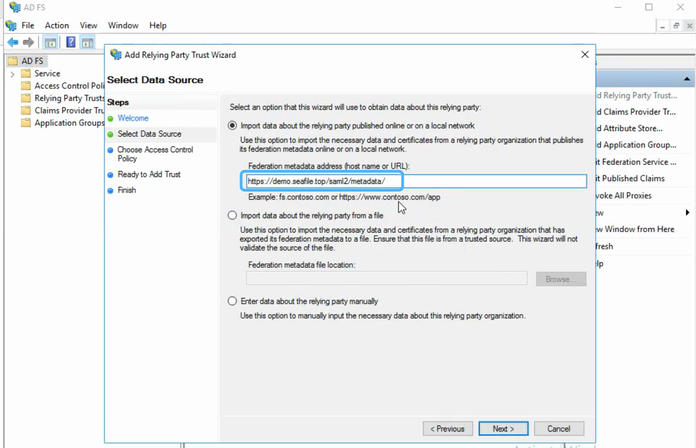

* On the **Specify Display Name** page type a name in **Display name**, e.g. `Seafile`, under **Notes** type a description for this relying party trust, and then click **Next**.

* In the **Choose an access control policy** window, select **Permit everyone**, then click **Next**.

* Review your settings, then click **Next**. 

* Click **Close**. 

**Next**, create claims rules:

* Open the ADFS management, click **Relying Party Trusts**.

* Right-click your trust, and then click **Edit Claim Issuance Policy**.

* On the **Issuance Transform Rules** tab click **Add Rules**.

* Click the **Claim rule template** dropdown menu and select **Send LDAP Attributes as Claims**, and then click **Next**. 

* In the **Claim rule name** field, type the display name for this rule, such as **Seafile Claim rule**. Click the **Attribute store** dropdown menu and select **Active Directory**. In the **LDAP Attribute** column, click the dropdown menu and select **User-Principal-Name**. In the **Outgoing Claim Type** column, click the dropdown menu and select **UPN**. And then click **Finish**.

* Click **Add Rule** again. 

* Click the **Claim rule template** dropdown menu and select **Transform an Incoming Claim**, and then click **Next**. 

* In the **Claim rule name** field, type the display name for this rule, such as **UPN to Name ID**. Click the **Incoming claim type** dropdown menu and select **UPN**(It must match the **Outgoing Claim Type** in rule `Seafile Claim rule`). Click the **Outgoing claim type** dropdown menu and select **Name ID**. Click the **Outgoing name ID format** dropdown menu and select **Email**. And then click **Finish**.

* Click **OK** to add both new rules.

!!! tip "When creating claims rule, you can also select other LDAP Attributes, such as E-Mail-Addresses, depending on your ADFS service"

**Finally**, open the browser and enter the Seafile login page, click `Single Sign-On` to perform ADFS login test.


### Example 3: Keycloak SAML 2.0
In this part, we use Keycloak SAML single sign-on app to show how Seafile integrate SAML 2.0.

#### Keycloak SAML single sign-on app

If you use Keycloak SAML app to achieve single sign-on, please follow the steps below:

The test domain name here is exemplified by `https://demo.seafile.top`.

**First**, Create a new Client: 

* Client type: Choose `SAML`；

* Client ID:  Fill in the SAML metadata address of Seafile (e.g.,**https://demo.seafile.top/saml2/metadata/**)
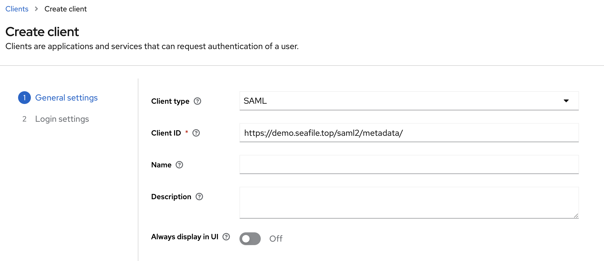

* Root URL and Home URL: Root Directory/Homepage, fill in the Seafile web service address (e.g.,**https://demo.seafile.top/**)

* Valid redirect URIs: Valid Redirect URIs, fill in all URLs of the Seafile web service (e.g.,**https://demo.seafile.top/***)
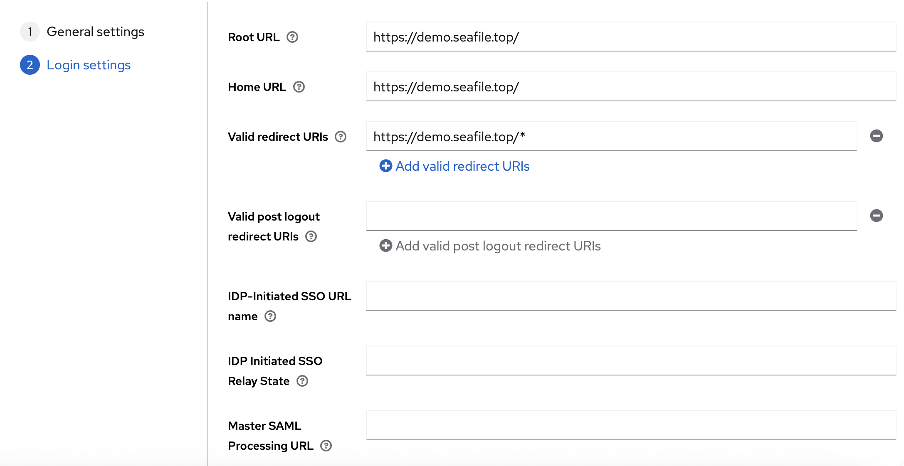

**Next**, open the client you just created and make the following modifications; leave all other settings as default.

* Settings - SAML capabilities: Set the **Name ID Format** to **email**, and only keep **Include AuthnStatement** enabled, disable all other settings.
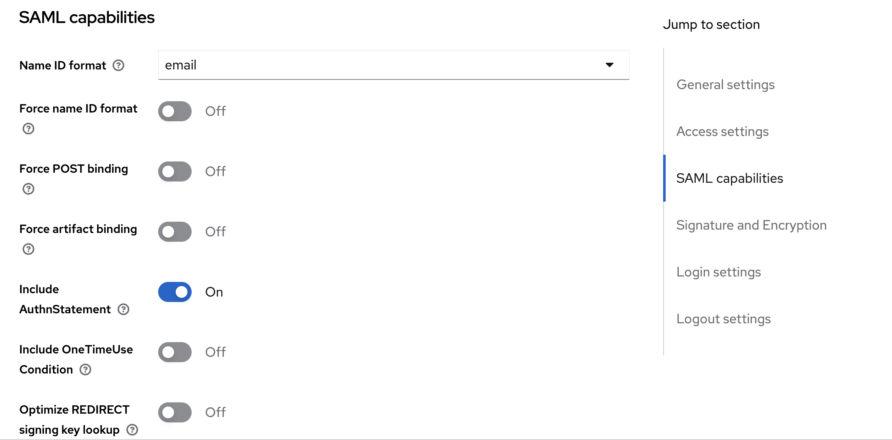

* Settings - Signature and Encryption: The default encryption algorithm is RSA_SHA256, so no changes are required.
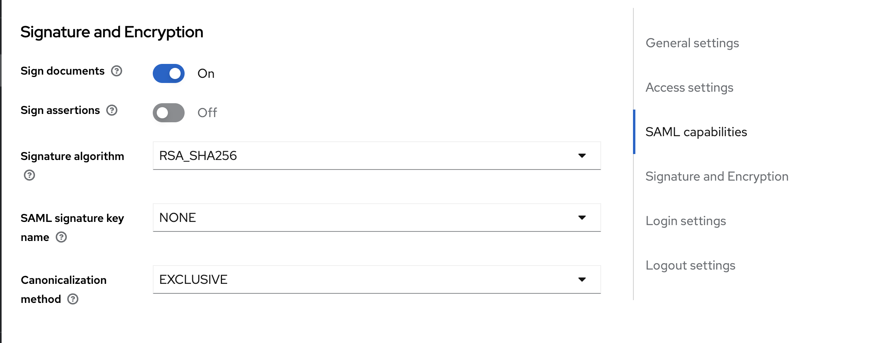

* Keys : Confirm that the Signing keys config is in the disabled state.
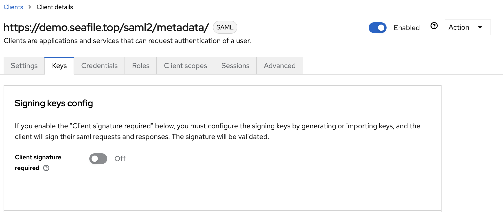

* Client scopes:  Configure the protocol mapping to map user information.
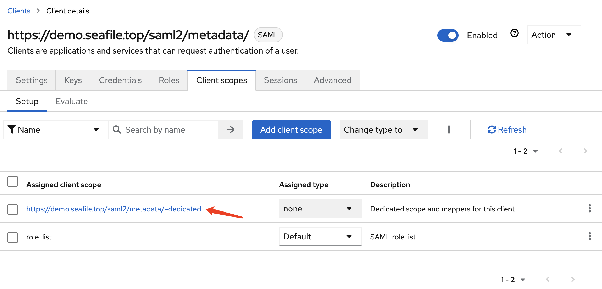

**Next**, choose the custom configuration **By configuration**:
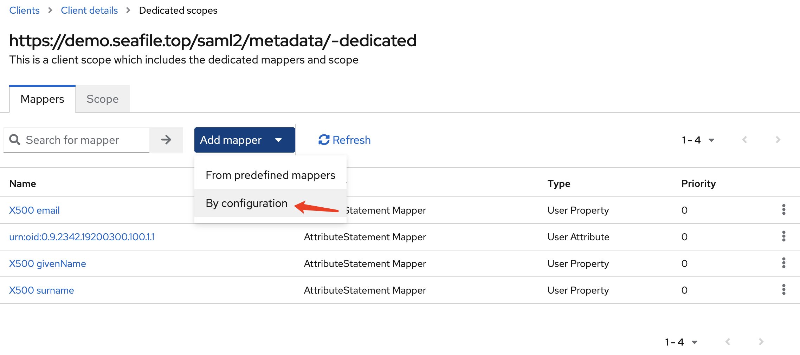

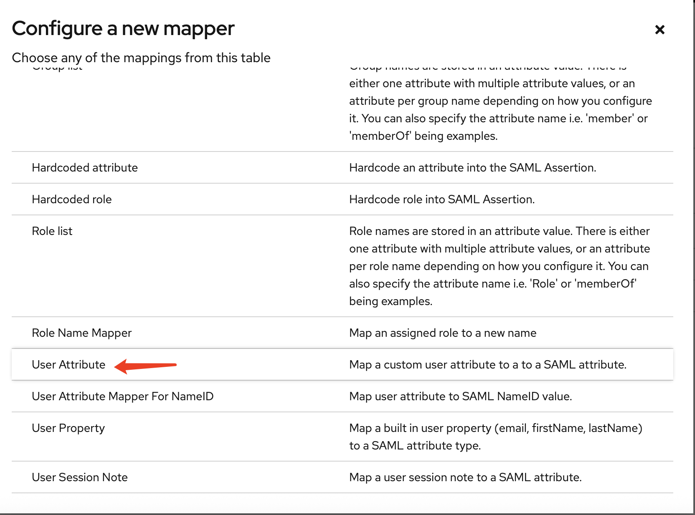

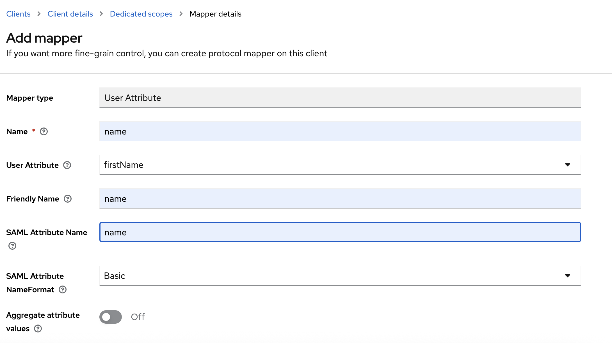

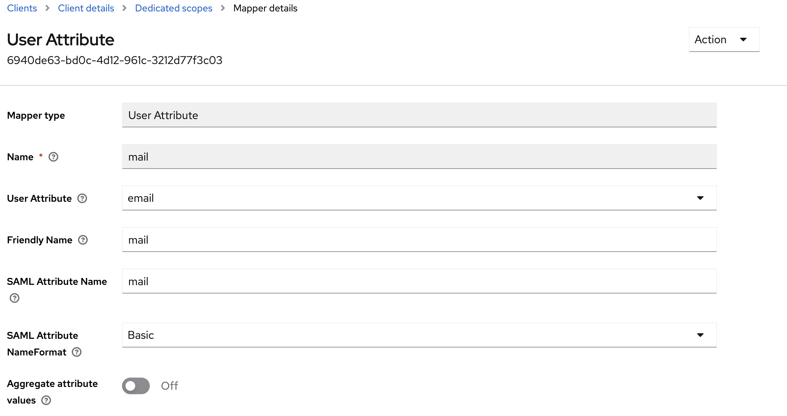

**Next**, ensure that the above two attributes are added. After adding them, the result is as follows:
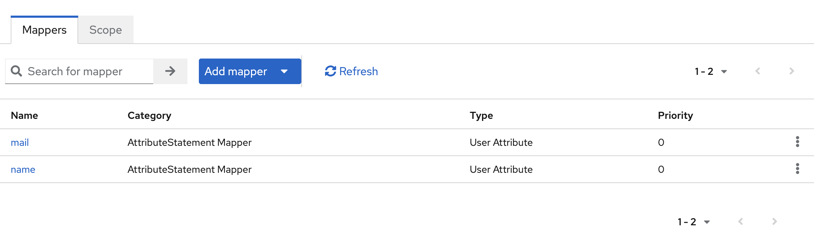

* Advanced - Fine Grain SAML Endpoint Configuration

    * Assertion Consumer Service POST Binding URL: Send the SAML assertion request to the SP using the POST method, and set it to the SAML ACS address of Seafile (e.g.,**https://demo.seafile.top/saml2/acs/**).

    * Assertion Consumer Service Redirect Binding URL: Send the SAML assertion request to the SP via the redirect method, and set it to Seafile's SAML ACS address (same as the Assertion Consumer Service POST Binding URL).

    * Logout Service POST Binding URL: The address for sending a logout request to the SP via the POST method. Fill in the SAML logout POST address of Seafile (e.g.,**https://demo.seafile.top/saml2/ls/post/**).

    * Logout Service Redirect Binding URL: The address for sending a logout request to the SP via the redirect method. Fill in Seafile's SAML logout address (e.g.,**https://demo.seafile.top/saml2/ls/**).
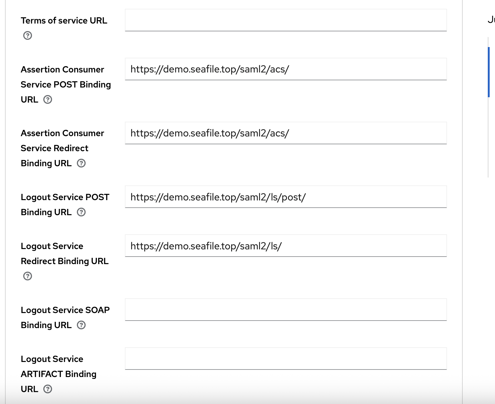

* Advanced - Authentication flow overrides: Bind the authenticator (the default account-password login uses the `Browser` flow).
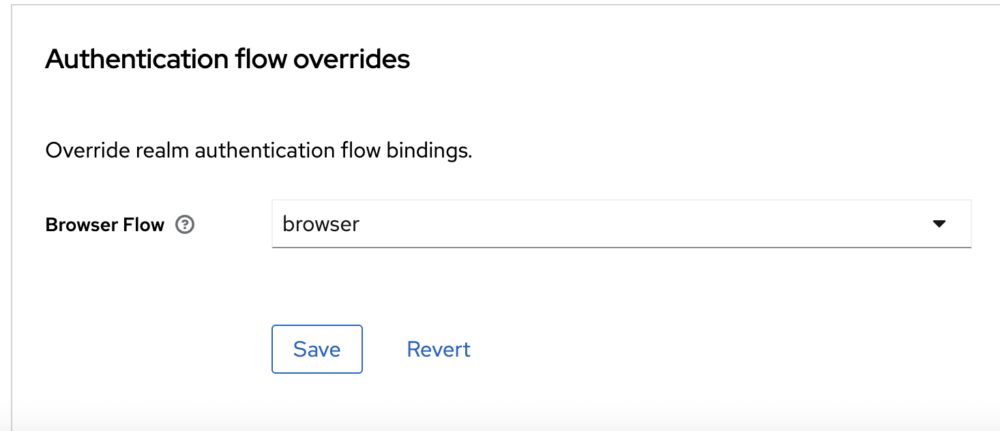

#### Seafile configuration 

```sh
cd /opt/seafile-data/seafile/conf/
vim seahub_settings.py 


ENABLE_ADFS_LOGIN = True
#SAML_CERTS_DIR is a path inside the container and does not need to be changed.
SAML_CERTS_DIR = '/opt/seafile/seahub-data/certs'
#The configuration format of SAML_REMOTE_METADATA_URL is '{idp_server_url}/realms/{realm}/protocol/saml/descriptor' 
#idp_server_url: The URL of the Keycloak service
#realm: Realm name
SAML_REMOTE_METADATA_URL = 'https://keycloak.seafile.com/realms/haiwen/protocol/saml/descriptor'
SAML_ATTRIBUTE_MAPPING = {
    'name': ('display_name', ),
    'mail': ('contact_email', ),
}


```

**Finally**, open the browser and enter the Seafile login page, click Single Sign-On, and use the user assigned to SAML app to perform a SAML login test.
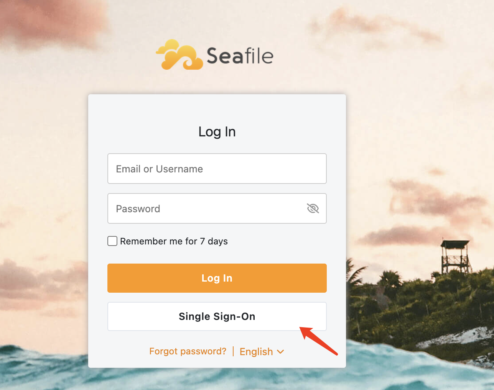
