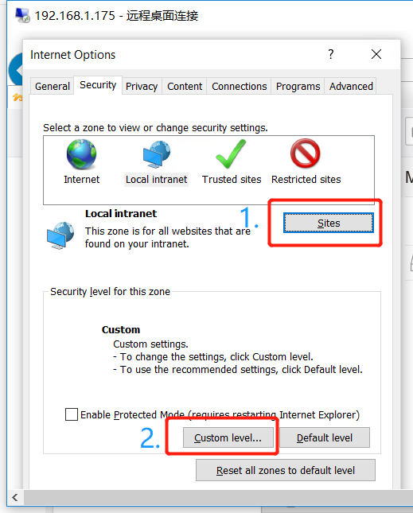

# Auto Login to SeaDrive on Windows

[Kerberos](https://web.mit.edu/kerberos/) is a widely used single sign on (SSO) protocol. Supporting of auto login will use a Kerberos service. For server configuration, please read [remote user authentication documentation](./remote_user.md). You have to configure Apache to authenticate with Kerberos. This is out of the scope of this documentation. You can for example refer to [this webpage](https://docs.active-directory-wp.com/Networking/Single_Sign_On/Kerberos_SSO_with_Apache_on_Linux.html).

## Technical Details

The client machine has to join the AD domain. In a Windows domain, the Kerberos Key Distribution Center (KDC) is implemented on the domain service. Since the client machine has been authenticated by KDC when a Windows user logs in, a Kerberos ticket will be generated for current user without needs of another login in the browser.

When a program using the WinHttp API tries to connect a server, it can perform a login automatically through the [Integrated Windows Authentication](https://en.wikipedia.org/wiki/Integrated_Windows_Authentication). Internet Explorer and SeaDrive both use this mechanism.

The details of Integrated Windows Authentication is described below:

1. Decide whether or not to use IWA according to the address and Internet Options. (more in next section)
2. Send a request to the server (e.g. http://test.seafile.com/sso)
3. The server returns an HTTP 401 unauthorized response with the Negotiate header which includes an authentication protocol.
4. The WinHttp API will try to use Kerberos first, if there is a valid ticket from KDC. The request will be sent again, together with the ticket in an HTTP header.
5. Then, Apache can check the ticket with KDC, and extract the username from it. The username will be passed to SeaHub for a successful auto login.
6. If the WinHttp API failed to get a ticket, it will then try the NTLM protocol by sending an HTTP request with Negotiate NTLMSSP token in the header. Without supporting the NTLM protocol, Apache shall returns an HTTP 401 unauthorized response and stops negotiation. At this point, the browser will pop up a login dialog, which means an auto login failure.

In short:

1. The client machine has to join the AD domain.
2. The Internet Options has to be configured properly.
3. The WinHttp API should be able to get a valid ticket from KDC. Make sure you use the correct server address (e.g. test.seafile.com) when you generate keytab file on the domain controller.

## Auto Login on Internet Explorer

The Internet Options has to be configured as following:

Open "Internet Options", select "Security" tab, select "Local Intranet" zone.

1. "Sites" -> "Advanced" -> "Add this website to zone". This is the place where we fill the address (e.g. http://test.seafile.com)
2. "Security level for this zone" -> "Custom level..." -> "Automatic log-on with current username and password".

Note: Above configuration requires a reboot to take effect.



Next, we shall test the auto login function on Internet Explorer: visit the website and click "Single Sign-On" link. It should be able to log in directly, otherwise the auto login is malfunctioned.

Note: The address in the test must be same as the address specified in the keytab file. Otherwise, the client machine can't get a valid ticket from Kerberos.

## Auto Login on SeaDrive

SeaDrive will use the Kerberos login configuration from the Windows Registry under `HKEY_CURRENT_USER/SOFTWARE/SeaDrive`.

```
Key   : PreconfigureServerAddr
Type  : REG_SZ
Value : <the url of seafile server>

Key   : PreconfigureUseKerberosLogin
Type  : REG_SZ
Value : <0|1> // 0 for normal login, 1 for SSO login
```

The system wide configuration path is located at `HKEY_LOCAL_MACHINE/SOFTWARE/Wow6432Node/SeaDrive`.

### SeaDrive Silent Installation

```
msiexec /i seadrive.msi /quiet /qn /log install.log

```

### Auto Login via Group Policy

The configuration of Internet Options : [https://docs.microsoft.com/en-us/troubleshoot/browsers/how-to-configure-group-policy-preference-settings](https://docs.microsoft.com/en-us/troubleshoot/browsers/how-to-configure-group-policy-preference-settings)

The configuration of Windows Registry : [https://thesolving.com/server-room/how-to-deploy-a-registry-key-via-group-policy/](https://thesolving.com/server-room/how-to-deploy-a-registry-key-via-group-policy/)
