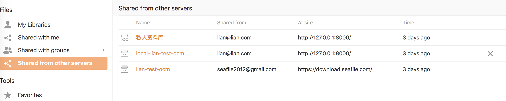

# OCM

From 8.0.0, Seafile supports [OCM protocol](https://rawgit.com/GEANT/OCM-API/v1/docs.html). 

With OCM, user can share library to other server which enabled OCM too.

## Configuration

Add the following configuration to `seahub_settings.py`.

```python
# Enable OCM
ENABLE_OCM = True
OCM_PROVIDER_ID = '71687320-6219-47af-82f3-32012707a5ae' # server unique id
OCM_REMOTE_SERVERS = [
    {
        "server_name": "dev",
        "server_url": "https://seafile-domain-1/", # should ends with '/'
    },
    {
        "server_name": "download",
        "server_url": "https://seafile-domain-2/", # should ends with '/'
    },
]
```

## Configuration

#### Share library to other server

In the library sharing dialog, jump to "Share to other server", you can share this library to user of other server with "Read-Only" or "Read-Write" permission. Also you can view shared records and cancel sharing.


#### View be shared libraries

User can jump to “Shared from other servers” page to view the libraries shared by other servers and cancel the sharing.


User can enter the library to view、 download、 and upload files.

