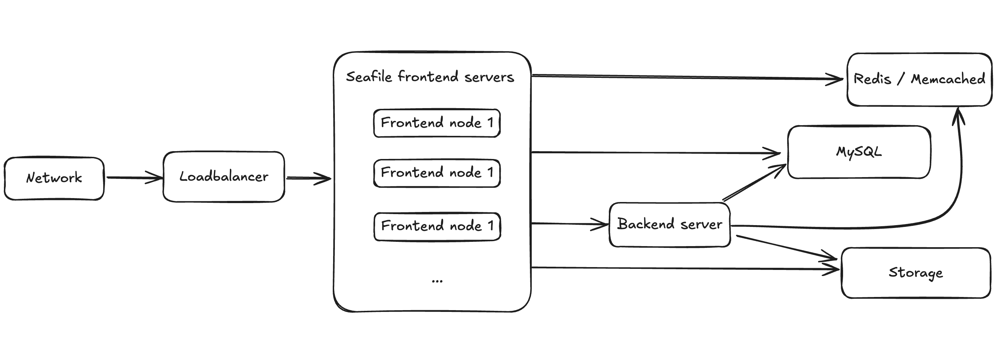

# Deploy in a cluster

**Update**: Since Seafile Pro server 6.0.0, cluster deployment requires "sticky session" settings in the load balancer. Otherwise sometimes folder download on the web UI can't work properly. Read the "Load Balancer Setting" section below for details

## Architecture

The Seafile cluster solution employs a 3-tier architecture:

* Load balancer tier: Distribute incoming traffic to Seafile servers. HA can be achieved by deploying multiple load balancer instances.
* Seafile server cluster: a cluster of Seafile server instances. If one instance fails, the load balancer will stop handing traffic to it. So HA is achieved.
* Backend storage: Distributed storage cluster, e.g.  S3, Openstack Swift or Ceph.

This architecture scales horizontally. That means, you can handle more traffic by adding more machines. The architecture is visualized in the following picture.



There are two main components on the Seafile server node: web server (Nginx/Apache) and Seafile app server. The web server passes requests from the clients to Seafile app server. The Seafile app servers work independently. They don't know about each other's state. That means each app server can fail independently without affecting other app server instances. The load balancer is responsible for detecting failure and re-routing requests.

Even though Seafile app servers work independently, they still have to share some session information. All shared session information is stored in memcached. Thus, all Seafile app servers have to connect to the same memcached server (cluster). More details about memcached configuration is available later.

The background server is the workhorse for various background tasks, including full-text indexing, office file preview, virus scanning, LDAP syncing. It should usually be run on a dedicated server for better performance. Currently only one background task server can be running in the entire cluster. If more than one background servers are running, they may conflict with each others when doing some tasks. If you need HA for background task server, you can consider using [Keepalived](http://www.keepalived.org/) to build a hot backup for it. More details can be found in [background server setup](enable_search_and_background_tasks_in_a_cluster.md).

All Seafile app servers access the same set of user data. The user data has two parts: One in the MySQL database and the other one in the backend storage cluster (S3, Ceph etc.). All app servers serve the data equally to the clients.

All app servers have to connect to the same database or database cluster. We recommend to use MariaDB Galera Cluster if you need a database cluster.

There are a few steps to deploy a Seafile cluster:

1. Prepare hardware, operating systems, memcached and database
2. Setup a single Seafile server node
3. Copy the deployment to other Seafile nodes
4. Setup Nginx/Apache and firewall rules
5. Setup load balancer
6. [Setup backgroup task node](enable_search_and_background_tasks_in_a_cluster.md)

## Preparation

### Hardware, Database, Memcached

At least 3 Linux server with at least 4 cores, 8GB RAM. Two servers work as frontend servers, while one server works as background task server. Virtual machines are sufficient for most cases.

In small cluster, you can re-use the 3 Seafile servers to run memcached cluster and MariaDB cluster. For larger clusters, you can have 3 more dedicated server to run memcached cluster and MariaDB cluster. Because the load on these two clusters are not high, they can share the hardware to save cost. Documentation about how to setup memcached cluster and MariaDB cluster can be found [here](memcached_mariadb_cluster.md)

### Install Python libraries

On each mode, you need to install some python libraries.

First make sure your have installed Python 2.7, then:

```
sudo easy_install pip
sudo pip install boto

```

If you receive an error stating "Wheel installs require setuptools >= ...", run this between the pip and boto lines above

```
sudo pip install setuptools --no-use-wheel --upgrade

```

## Configure a Single Node

You should make sure the config files on every Seafile server are consistent.

### Get the license

Put the license you get under the top level diretory. In our wiki, we use the diretory `/data/haiwen/` as the top level directory.

### Download/Uncompress Seafile Professional Server

```
tar xf seafile-pro-server_6.1.3_x86-64.tar.gz

```

Now you have:

```
haiwen
├── seafile-license.txt
└── seafile-pro-server-6.1.3/

```

### Setup Seafile

Please follow [Download and Setup Seafile Professional Server With MySQL](download_and_setup_seafile_professional_server.md) to setup a single Seafile server node.

Note: **Use the load balancer's address or domain name for the server address. Don't use the local IP address of each Seafile server machine. This assures the user will always access your service via the load balancers.**

After the setup process is done, you still have to do a few manual changes to the config files.

#### seafile.conf

If you use a single memcached server, you have to add the following configuration to `seafile.conf`

```
[cluster]
enabled = true

[memcached]
memcached_options = --SERVER=192.168.1.134 --POOL-MIN=10 --POOL-MAX=100

```

If you use memcached cluster, the recommended way to setup memcached clusters can be found [here](memcached_mariadb_cluster.md).

You'll setup two memcached server, in active/standby mode. A floating IP address will be assigned to the current active memcached node. So you have to configure the address in seafile.conf accordingly.

```
[cluster]
enabled = true

[memcached]
memcached_options = --SERVER=<floating IP address> --POOL-MIN=10 --POOL-MAX=100

```

(Optional) The Seafile server also opens a port for the load balancers to run health checks. Seafile by default uses port 11001. You can change this by adding the following config option to `seafile.conf`

```
[cluster]
health_check_port = 12345

```

#### seahub_settings.py

You must setup and use memcached when deploying Seafile cluster. Refer to ["add memcached"](../deploy/add_memcached.md) to use memcached in Seahub.

Also add following options to seahub_setting.py. These settings tell Seahub to store avatar in database and cache avatar in memcached, and store css CACHE to local memory.

```
AVATAR_FILE_STORAGE = 'seahub.base.database_storage.DatabaseStorage'

```

#### seafevents.conf

Add following to `seafevents.conf` to disable file indexing service on the local server. The file indexing service should be started on a dedicated background server.

```
[INDEX FILES]
external_es_server = true

```

Here is an example `[INDEX FILES]` section:

```
[INDEX FILES]
enabled = true
interval = 10m
highlight = fvh     # This configuration is only available for Seafile 6.3.0 pro and above.
index_office_pdf = true
external_es_server = true
es_host = background.seafile.com
es_port = 9200

```

Note: `enable = true` should be left unchanged. For versions older than 6.1, `es_port` was 9500.

### Update Seahub Database

In cluster environment, we have to store avatars in the database instead of in a local disk.

```
CREATE TABLE `avatar_uploaded` (`filename` TEXT NOT NULL, `filename_md5` CHAR(32) NOT NULL PRIMARY KEY, `data` MEDIUMTEXT NOT NULL, `size` INTEGER NOT NULL, `mtime` datetime NOT NULL);

```

### Backend Storage Settings

You also need to add the settings for backend cloud storage systems to the config files.

* For NFS: [Setup Seafile cluster with NFS](setup_seafile_cluster_with_nfs.md)
* For S3: [Setup With Amazon S3](setup_with_amazon_s3.md)
* For OpenStack Swift: [Setup With OpenStackSwift](setup_with_openstackswift.md)
* For Ceph: [Setup With Ceph](setup_with_ceph.md)
* For OSS: [Setup With Alibaba OSS](setup_with_oss.md)

### Run and Test the Single Node

Once you have finished configuring this single node, start it to test if it runs properly:

```
cd /data/haiwen/seafile-server-latest
./seafile.sh start
./seahub.sh start

```

_Note:_ The first time you start seahub, the script would prompt you to create an admin account for your Seafile server.

Open your browser, visit <http://ip-address-of-this-node:8000> and login with the admin account.

## Configure other nodes

Now you have one node working fine, let's continue to configure more nodes.

### Copy the config to all Seafile servers

Supposed your Seafile installation directory is `/data/haiwen`, compress this whole directory into a tarball and copy the tarball to all other Seafile server machines. You can simply uncompress the tarball and use it.

On each node, run `./seafile.sh` and `./seahub.sh` to start Seafile server.

## Setup Nginx/Apache and Https

You'll usually want to use Nginx/Apache and https for web access. You need to set it up on each machine running Seafile server. **Make sure the certificate on all the servers are the same.**

* For Nginx:
  * [Config Seahub with Nginx](../deploy/deploy_with_nginx.md)
  * [Enabling Https with Nginx](../deploy/https_with_nginx.md)
* For Apache:
  * [Config Seahub with Apache](../deploy/deploy_with_apache.md)
  * [Enabling Https with Apache](../deploy/https_with_apache.md)

## Start Seafile Service on boot

It would be convenient to setup Seafile service to start on system boot. Follow [this documentation](../deploy/start_seafile_at_system_bootup.md) to set it up on **all nodes**.

## Firewall Settings

Beside [standard ports of a seafile server](../deploy/using_firewall.md), there are 2 firewall rule changes for Seafile cluster:

* On each Seafile server machine, you should open the health check port (default 11001);
* On the memcached server, you should open the port 11211. For security resons only the Seafile servers should be allowed to access this port.

## Load Balancer Setting

Now that your cluster is already running, fire up the load balancer and welcome your users. Since version 6.0.0, Seafile Pro requires "sticky session" settings in the load balancer. You should refer to the manual of your load balancer for how to set up sticky sessions.

### AWS Elastic Load Balancer (ELB)

In the AWS ELB management console, after you've added the Seafile server instances to the instance list, you should do two more configurations.

First you should setup HTTP(S) listeners. Ports 443 and 80 of ELB should be forwarded to the ports 80 or 443 of the Seafile servers.

Then you setup health check


Refer to [AWS documentation](http://docs.aws.amazon.com/elasticloadbalancing/latest/classic/elb-sticky-sessions.html) about how to setup sticky sessions.

### HAProxy

This is a sample `/etc/haproxy/haproxy.cfg`:

(Assume your health check port is `11001`)

```
global
    log 127.0.0.1 local1 notice
    maxconn 4096
    user haproxy
    group haproxy

defaults
    log global
    mode http
    retries 3
    maxconn 2000
    timeout connect 10000
    timeout client 300000
    timeout server 300000

listen seafile 0.0.0.0:80
    mode http
    option httplog
    option dontlognull
    option forwardfor
    cookie SERVERID insert indirect nocache
    server seafileserver01 192.168.1.165:80 check port 11001 cookie seafileserver01
    server seafileserver02 192.168.1.200:80 check port 11001 cookie seafileserver02

```

## See how it runs

Now you should be able to test your cluster. Open <https://seafile.example.com> in your browser and enjoy. You can also synchronize files with Seafile clients.

If the above works, the next step would be [Enable search and background tasks in a cluster](enable_search_and_background_tasks_in_a_cluster.md).

## The final configuration of the front-end nodes

Here is the summary of configurations at the front-end node that related to cluster setup.

### 7.0 or older versions

For **seafile.conf**:

```
[cluster]
enabled = true
memcached_options = --SERVER=<IP of memcached node> --POOL-MIN=10 --POOL-MAX=100

```

The `enabled` option will prevent the start of background tasks by `./seafile.sh start` in the front-end node. The tasks should be explicitly started by `./seafile-background-tasks.sh start` at the back-end node.

For **seahub_settings.py**:

```
AVATAR_FILE_STORAGE = 'seahub.base.database_storage.DatabaseStorage'

OFFICE_CONVERTOR_ROOT = 'http://<ip of node background>'

```

For **seafevents.conf**:

```
[INDEX FILES]
enabled = true
interval = 10m
highlight = fvh     # This configuration is only available for Seafile 6.3.0 pro and above.
external_es_server = true
es_host = <IP of background node>
es_port = 9200

[OFFICE CONVERTER]
enabled = true
workers = 1
## how many pages are allowed to be previewed online. Default is 50 pages
max-pages = 50
## the max size of documents allowed to be previewed online, in MB. Default is 10 MB
## Previewing a large file (for example >30M) online is likely going to freeze the browser.
max-size = 10

```

The `[INDEX FILES]` section is needed to let the front-end node know the file search feature is enabled. The `external_es_server = true` is to tell the front-end node not to start the ElasticSearch but to use the ElasticSearch server at the back-end node.

The `[OFFICE CONVERTER]` section is needed to let the front-end node know the office preview feature is enabled.

### 7.1+

For **seafile.conf**:

```
[cluster]
enabled = true
memcached_options = --SERVER=<IP of memcached node> --POOL-MIN=10 --POOL-MAX=100

```

The `enabled` option will prevent the start of background tasks by `./seafile.sh start` in the front-end node. The tasks should be explicitly started by `./seafile-background-tasks.sh start` at the back-end node.

For **seahub_settings.py**:

```
AVATAR_FILE_STORAGE = 'seahub.base.database_storage.DatabaseStorage'

OFFICE_CONVERTOR_ROOT = 'http://<ip of node background>:6000'

```

For **seafevents.conf**:

```
[INDEX FILES]
enabled = true
interval = 10m
highlight = fvh     # This configuration is for improving searching speed
external_es_server = true
es_host = <IP of background node>
es_port = 9200

[OFFICE CONVERTER]
enabled = true
workers = 1
## the max size of documents allowed to be previewed online, in MB. Default is 10 MB
## Previewing a large file (for example >30M) online is likely going to freeze the browser.
max-size = 10
host = <ip of node background>
port = 6000

```

The `[INDEX FILES]` section is needed to let the front-end node know the file search feature is enabled. The `external_es_server = true` is to tell the front-end node not to start the ElasticSearch but to use the ElasticSearch server at the back-end node.

The `[OFFICE CONVERTER]` section is needed to let the front-end node know the office preview feature is enabled.


