Multi-tenancy feature is designed for hosting providers that what to host several customers in a single Seafile instance. You can create multi-organizations. Organizations is separated from each other. Users can't share libraries between organizations.

## Seafile Config ##

#### seafile.conf

```
[general]
multi_tenancy = true
```

#### seahub_settings.py

```python
CLOUD_MODE = True
MULTI_TENANCY = True

ORG_MEMBER_QUOTA_ENABLED = True

ORG_ENABLE_ADMIN_CUSTOM_NAME = True  # Default is True, meaning organization name can be customized
ORG_ENABLE_ADMIN_CUSTOM_LOGO = False  # Default is False, if set to True, organization logo can be customized

ENABLE_MULTI_ADFS = True  # Default is False, if set to True, support per organization custom ADFS/SAML2 login
LOGIN_REDIRECT_URL = '/saml2/complete/'
SAML_ATTRIBUTE_MAPPING = {
    'name': ('display_name', ),
    'mail': ('contact_email', ),
    ...
}
```

## Usage

An organization can be created via system admin in “admin panel->organization->Add organization”.

Every organization has an URL prefix. This field is *for future usage*. When a user create an organization, an URL like org1 will be automatically assigned.

After creating an organization, the first user will become the admin of that organization. The organization admin can add other users. Note, the system admin can't add users.

## ADFS/SAML single sign-on integration in multi-tenancy

### Preparation for ADFS/SAML

**The _system admin_ has to complete the following works.**

**Fisrt**, install xmlsec1 package:

```
$ apt update
$ apt install xmlsec1
```

**Second**, prepare SP(Seafile) certificate directory and SP certificates:

Create sp certs dir

```
$ mkdir -p /opt/seafile/seahub-data/certs
```

The SP certificate can be generated by the openssl command, or you can apply to the certificate manufacturer, it is up to you. For example, generate the SP certs using the following command:

```
$ cd /opt/seafile/seahub-data/certs
$ openssl req -x509 -nodes -days 365 -newkey rsa:2048 -keyout sp.key -out sp.crt
```

__Note__: The `days` option indicates the validity period of the generated certificate. The unit is day. The system admin needs to update the certificate regularly.

**Finally**, add the following configuration to seahub_settings.py and then restart Seafile:

```python
ENABLE_MULTI_ADFS = True
LOGIN_REDIRECT_URL = '/saml2/complete/'
SAML_ATTRIBUTE_MAPPING = {
    'name': ('display_name', ),
    'mail': ('contact_email', ),
    ...
}
```

__Note__: If the xmlsec1 binary is **not located in** `/usr/bin/xmlsec1`, you need to add the following configuration in seahub_settings.py:

```python
SAML_XMLSEC_BINARY_PATH = '/path/to/xmlsec1'
```

View where the xmlsec1 binary is located:

```
$ which xmlsec1
```

__Note__: If certificates are **not placed in** `/opt/seafile/seahub-data/certs`, you need to add the following configuration in seahub_settings.py:

```python
SAML_CERTS_DIR = '/path/to/certs'
```

### Integration with ADFS/SAML single sign-on

The _organization admin_ has to complete the following works. The detailed steps depends on which ADFS service you use. We provide integration steps for Azure SAML SSO and on-premise ADFS.

#### Integration with Microsoft Azure SAML single sign-on app

If you use Microsoft Azure SAML app to achieve single sign-on, please follow the steps below:

**First**, add SAML application and assign users, refer to: [add an Azure AD SAML application](https://docs.microsoft.com/en-us/azure/active-directory/manage-apps/add-application-portal), [create and assign users](https://docs.microsoft.com/en-us/azure/active-directory/manage-apps/add-application-portal-assign-users)

**Second**, setup your SAML login URL in the Seafile organization admin interface. The format of the login URL is: https://example.com/org/custom/{custom-part}/, e.g.:

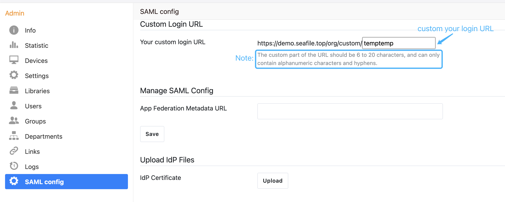

**Then**, setup the _Identifier_, _Reply URL_, and _Sign on URL_ of the SAML app based on your login URL, refer to: [enable single sign on for saml application](https://learn.microsoft.com/en-us/azure/active-directory/manage-apps/add-application-portal-setup-sso). The format of the _Identifier_, _Reply URL_, and _Sign on URL_ are: https://example.com/org/custom/{custom-part}/saml2/metadata/, https://example.com/org/custom/{custom-part}/saml2/acs/, https://example.com/org/custom/{custom-part}/, e.g.:

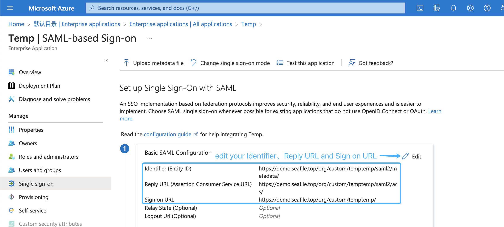

__Note__: The {custom-part} of the URL should be 6 to 20 characters, and can only contain alphanumeric characters and hyphens.

**Next**, copy the metadata URL of the SAML app:

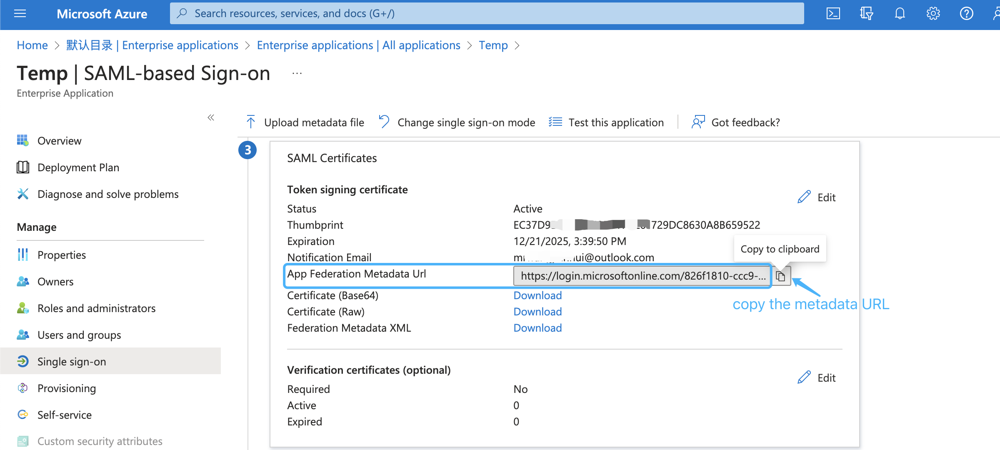

and paste it into the organization admin interface, e.g:

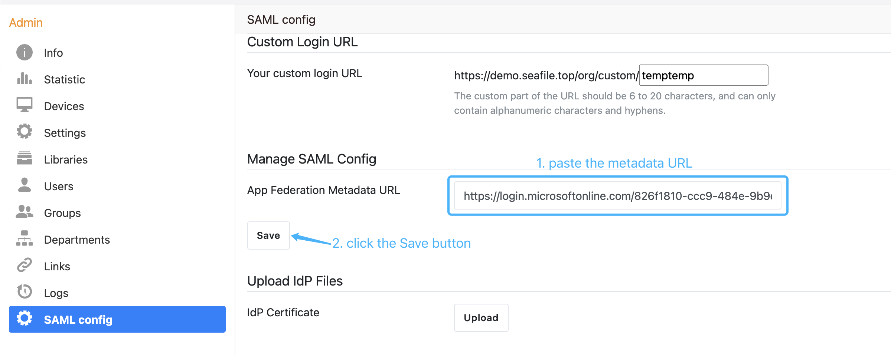

**Next**, download the base64 format SAML app's certificate and rename to idp.crt:

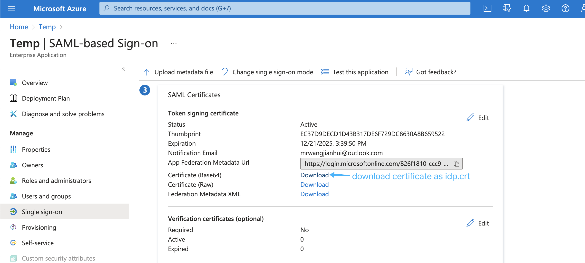

and upload the idp.crt in the organization admin interface:

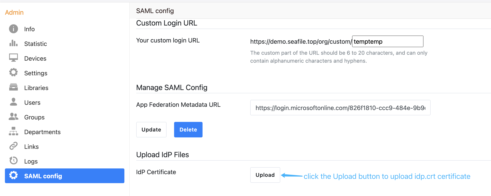

**Next**, [edit saml attributes & claims](https://learn.microsoft.com/en-us/azure/active-directory/develop/saml-claims-customization). Keep the default attributes & claims of SAML app unchanged, the _uid_ attribute must be added, the _mail_ and _name_ attributes are optional, e.g.:

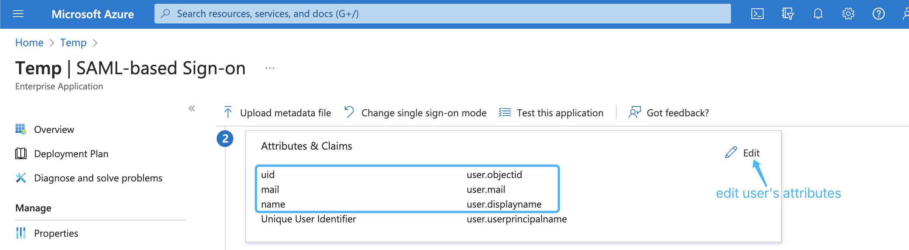

**Finally**, open the browser and enter your custom login URL into the browser, e.g.:

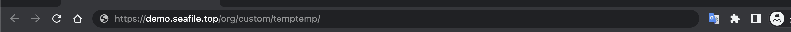

Click the Enter key will jump to the SAML app login page, e.g.:

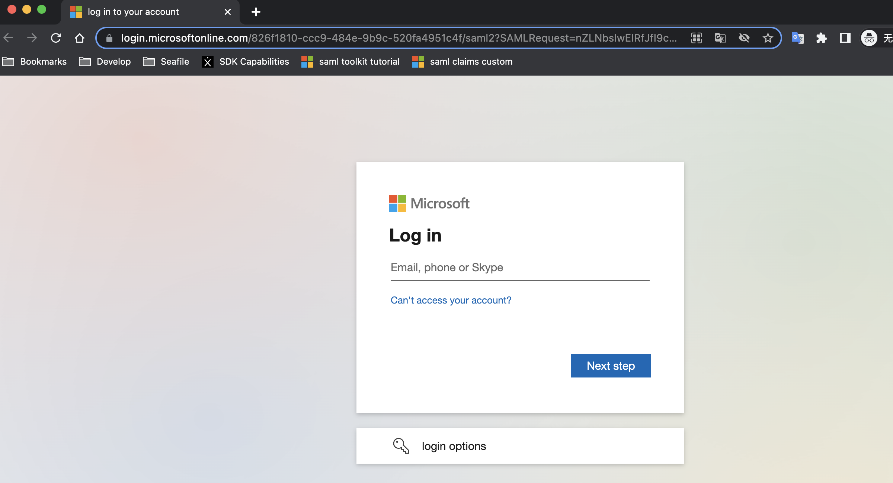

#### Integration with on-premise ADFS

If you use Microsoft ADFS to achieve single sign-on, please follow the steps below:

**First**, please make sure the following preparations are done:

1. A Windows Server with [ADFS](https://learn.microsoft.com/en-us/windows-server/identity/active-directory-federation-services) installed. For configuring and installing ADFS you can see [this article](https://learn.microsoft.com/en-us/windows-server/identity/ad-fs/deployment/deploying-a-federation-server-farm).

2. A valid SSL certificate for ADFS server, and here we use `temp.adfs.com` as the domain name example.

3. A valid SSL certificate for Seafile server, and here we use `demo.seafile.com` as the domain name example.

**Second**, setup your ADFS login URL in the Seafile organization admin interface. The format of the login URL is: `https://example.com/org/custom/{custom-part}/`, e.g.:


**Next**, setup the federation metadata URL of Microsoft ADFS in the organization admin interface. The format of the federation metadata URL is: `https://{your ADFS domain name}/federationmetadata/2007-06/federationmetadata.xml`, e.g:

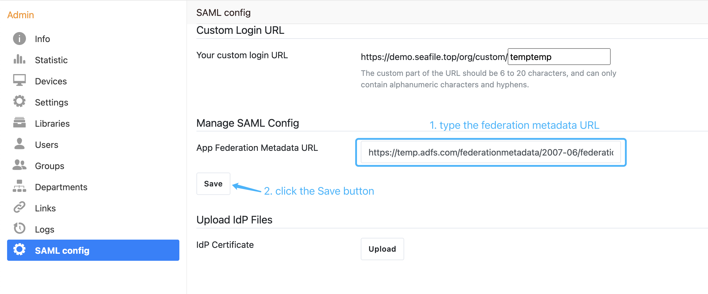

**Next**, download the base64 format certificate and upload it:

* Navigate to the _AD FS_ management window. In the left sidebar menu, navigate to **Services** > **Certificates**. 

* Locate the _Token-signing_ certificate. Right-click the certificate and select **View Certificate**.

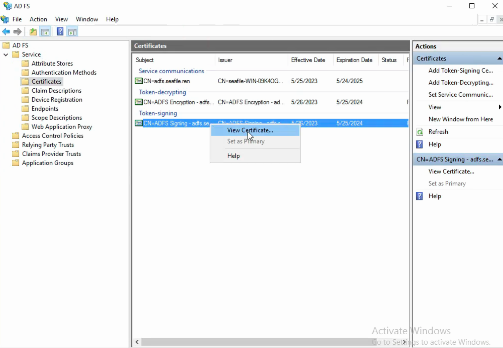

* In the dialog box, select the **Details** tab.

* Click **Copy to File**.

* In the _Certificate Export Wizard_ that opens, click **Next**.

* Select **Base-64 encoded X.509 (.CER)**, then click **Next**.

* Named it **idp.crt**, then click **Next**.

* Click **Finish** to complete the download.

* And then upload the idp.crt in the organization admin interface:

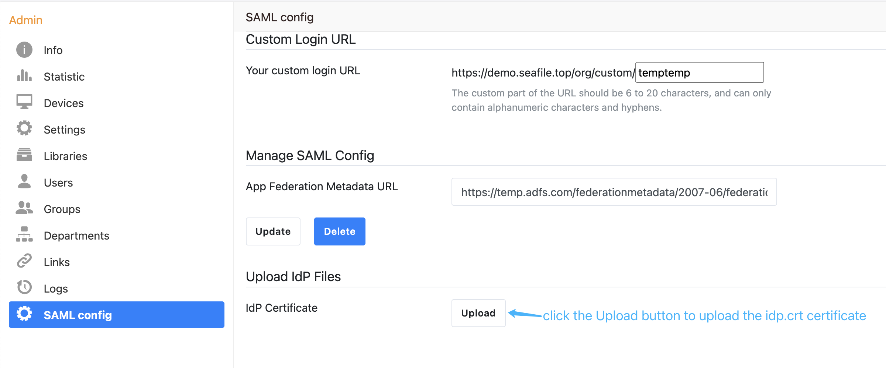

**Next**, add [relying party trust](https://learn.microsoft.com/en-us/windows-server/identity/ad-fs/operations/create-a-relying-party-trust#to-create-a-claims-aware-relying-party-trust-using-federation-metadata):

* Log into the ADFS server and open the ADFS management.

* Under **Actions**, click **Add Relying Party Trust**.

* On the Welcome page, choose **Claims aware** and click **Start**.

* Select **Import data about the relying party published online or on a local network**, type your organization metadate url in **Federation metadata address (host name or URL)**, and then click **Next**. Your organization metadate url format is: `https://example.com/org/custom/{custom-part}/saml2/metadata/`, e.g.:

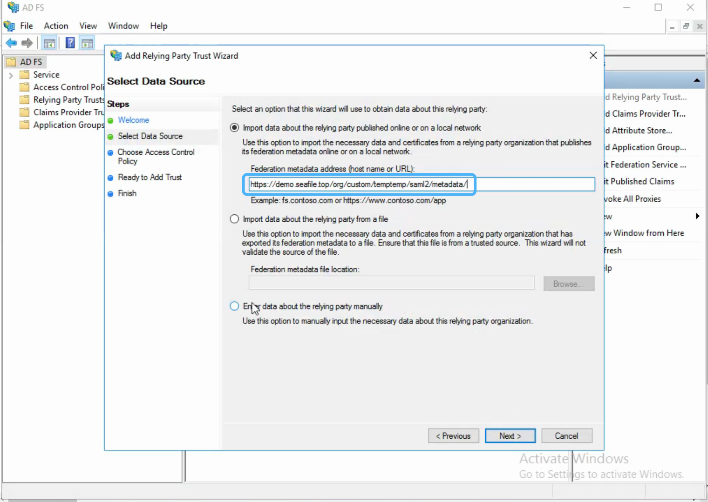

* On the **Specify Display Name** page type a name in **Display name**, e.g. `Seafile`, under **Notes** type a description for this relying party trust, and then click **Next**.

* In the **Choose an access control policy** window, select **Permit everyone**, then click **Next**.

* Review your settings, then click **Next**. 

* Click **Close**. 

**Next**, create claims rules:

* Open the ADFS management, click **Relying Party Trusts**.

* Right-click your trust, and then click **Edit Claim Issuance Policy**.

* On the **Issuance Transform Rules** tab click **Add Rules**.

* Click the **Claim rule template** dropdown menu and select **Send LDAP Attributes as Claims**, and then click **Next**. 

* In the **Claim rule name** field, type the display name for this rule, such as **Seafile Claim rule**. Click the **Attribute store** dropdown menu and select **Active Directory**. In the **LDAP Attribute** column, click the dropdown menu and select **User-Principal-Name**. In the **Outgoing Claim Type** column, click the dropdown menu and select **UPN**. And then click **Finish**.

* Click **Add Rule** again. 

* Click the **Claim rule template** dropdown menu and select **Transform an Incoming Claim**, and then click **Next**. 

* In the **Claim rule name** field, type the display name for this rule, such as **UPN to Name ID**. Click the **Incoming claim type** dropdown menu and select **UPN**(It must match the **Outgoing Claim Type** in rule `Seafile Claim rule`). Click the **Outgoing claim type** dropdown menu and select **Name ID**. Click the **Outgoing name ID format** dropdown menu and select **Email**. And then click **Finish**.

* Click **OK** to add both new rules.

__Note__: When creating claims rule, you can also select other LDAP Attributes, such as E-Mail-Addresses, depending on your ADFS service.

**Finally**, open the browser and enter your custom login URL into the browser to perform a ADFS login test.
