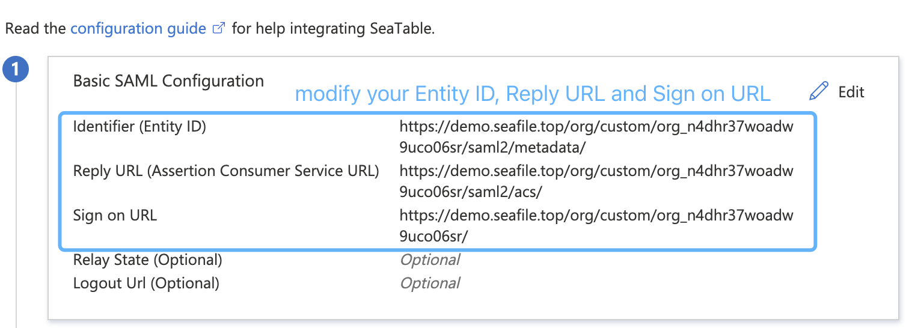
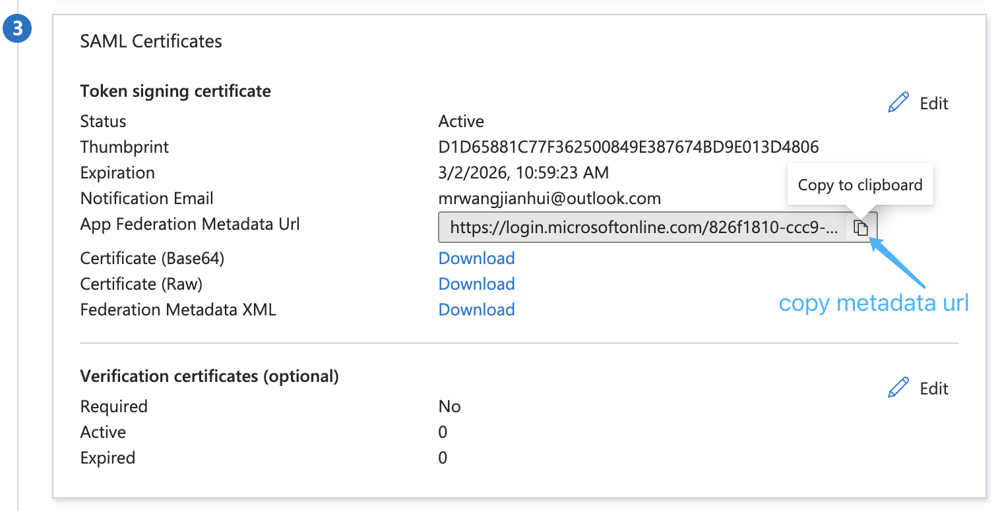
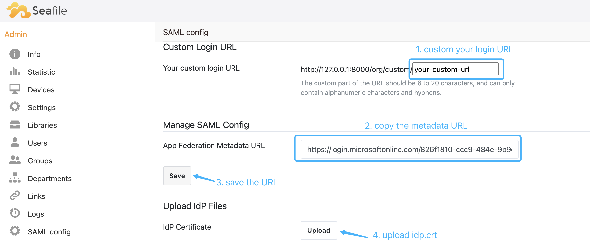

Multi-tenancy feature is designed for hosting providers that what to host several customers in a single Seafile instance. You can create multi-organizations. Organizations is separated from each other. Users can't share libraries between organizations.

## Seafile Config ##

#### seafile.conf

```
[general]
multi_tenancy = true
```

#### seahub_settings.py

```
CLOUD_MODE = True
MULTI_TENANCY = True

ORG_MEMBER_QUOTA_ENABLED = True

ORG_ENABLE_ADMIN_CUSTOM_NAME = True  # Default is True, meaning organization name can be customized
ORG_ENABLE_ADMIN_CUSTOM_LOGO = False  # Default is False, if set to True, organization logo can be customized

ENABLE_MULTI_ADFS = True  # Default is False, if set to True, support per organization custom ADFS/SAML2 login
SAML_ATTRIBUTE_MAPPING = {
    'mail': 'contact_email',
    'displayName': 'display_name',
}
```

## Usage

An organization can be created via system admin in “admin panel->organization->Add organization”.

Every organization has an URL prefix. This field is *for future usage*. When a user create an organization, an URL like org1 will be automatically assigned.

After creating an organization, the first user will become the admin of that organization. The organization admin can add other users. Note, the system admin can't add users.

## MULTI ADFS

1\. Install xmlsec1

```
$ apt update
$ apt install xmlsec1
```

2\. **Sysadmin** prepares certificate directory for organization and generates SP certificate

Create certs dir

```
$ mkdir -p /opt/seafile/seahub-data/certs/<org_id>
```

**Sysadmin** can generate them by:

```
$ cd /opt/seafile/seahub-data/certs/<org_id>
$ openssl req -x509 -nodes -days 3650 -newkey rsa:2048 -keyout sp.key -out sp.crt
```

__Note__: The certificates of different organizations need to be put in different _org_id_ sub-directories.

3\. Configure Seafile

Add the following configuration to seahub_settings.py and then restart Seafile:

```python
ENABLE_ADFS_LOGIN = True
SAML_ATTRIBUTE_MAPPING = {
    'mail': 'contact_email',
    'name': 'display_name',
}
```

__Note__: If the xmlsec1 binary is **not situated in** `/usr/bin/xmlsec1`, you need to add the following configuration in seahub_settings.py:

```python
SAML_XMLSEC_BINARY_PATH = '/path/to/xmlsec1'
```

View where the xmlsec1 binary is situated:

```
$ which xmlsec1
```

__Note__: If certificates are **not placed in** `/opt/seafile/seahub-data/certs`, you need to add the following configuration in seahub_settings.py:

```python
SAML_CERTS_DIR = '/path/to/certs'
```

4\. **Organization admin** Configure Azure SAML

Add application: <https://docs.microsoft.com/en-us/azure/active-directory/manage-apps/add-application-portal>

Assign users: <https://docs.microsoft.com/en-us/azure/active-directory/manage-apps/add-application-portal-assign-users>

Set up SSO with SAML: 


Your _meradate url_, _acs url_, _service url_ might like this:



__Note__: The _org_n4dhr37woadw9uco06sr_ is a customizable string, you can customize according to your own needs: https://example.com/org/custom/{custom-part}/

5\. Download Azure AD certificate

Download base64 format signing certificate, rename to idp.crt.


6\. Configures options related to SAML login

**Organization admin** configures options related to SAML login in the organization management interface.





7\. Open the browser and enter https://example.com/org/custom/{custom-part}/ for single sign-on.
