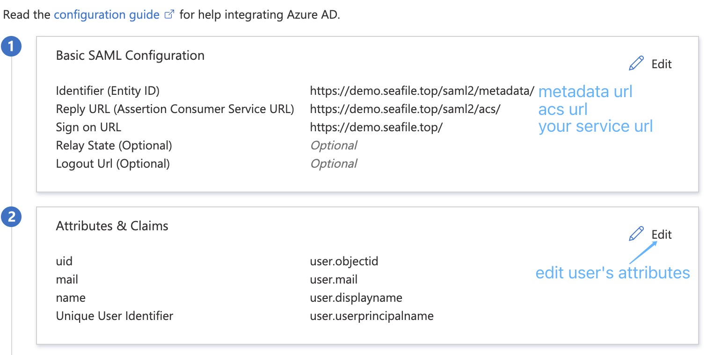
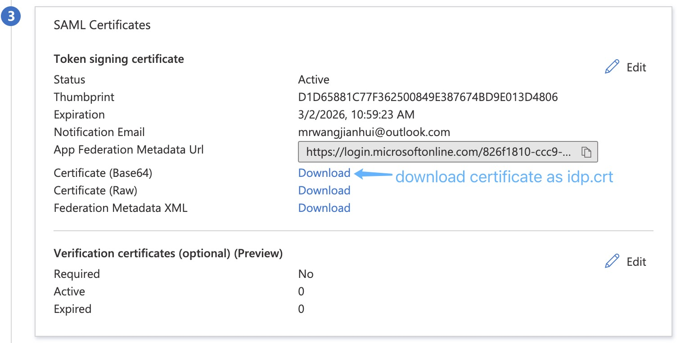

# SAML 2.0 in version 10.0

In this document, we use Azure SAML to show the steps to connect Seafile with SAML. Other SAML provider should be similar.

1\. Install xmlsec1

```
$ apt update
$ apt install xmlsec1
```

2\. Prepare Certs File

Create certs dir

```
$ mkdir -p /opt/seafile/seahub-data/certs
```

You can generate them by:

```
$ cd /opt/seafile/seahub-data/certs
$ openssl req -x509 -nodes -days 3650 -newkey rsa:2048 -keyout sp.key -out sp.crt
```

3\. Configure Seafile

Add the following configuration to seahub_settings.py and then restart Seafile:

```python
ENABLE_ADFS_LOGIN = True
LOGIN_REDIRECT_URL = '/saml2/complete/'
SAML_REMOTE_METADATA_URL = 'https://login.microsoftonline.com/xxx/federationmetadata/2007-06/federationmetadata.xml?appid=xxx'
SAML_ATTRIBUTE_MAPPING = {
    'name': ('display_name', ),
    'mail': ('contact_email', ),
    ...
}
```

__Note__: If the xmlsec1 binary is **not situated in** `/usr/bin/xmlsec1`, you need to add the following configuration in seahub_settings.py:

```python
SAML_XMLSEC_BINARY_PATH = '/path/to/xmlsec1'
```

View where the xmlsec1 binary is situated:

```
$ which xmlsec1
```

__Note__: If certificates are **not placed in** `/opt/seafile/seahub-data/certs`, you need to add the following configuration in seahub_settings.py:

```python
SAML_CERTS_DIR = '/path/to/certs'
```

4\. Configure Azure SAML

Add application: <https://docs.microsoft.com/en-us/azure/active-directory/manage-apps/add-application-portal>

Assign users: <https://docs.microsoft.com/en-us/azure/active-directory/manage-apps/add-application-portal-assign-users>

Set up SSO with SAML: 



5\. Upload Azure AD certificate

Download base64 format signing certificate, rename to idp.crt, and then put it under the certs directory.



6\. Log in to the Seafile homepage, click single sign-on, and use the user assigned to Azure SAML to perform a SAML login test.
