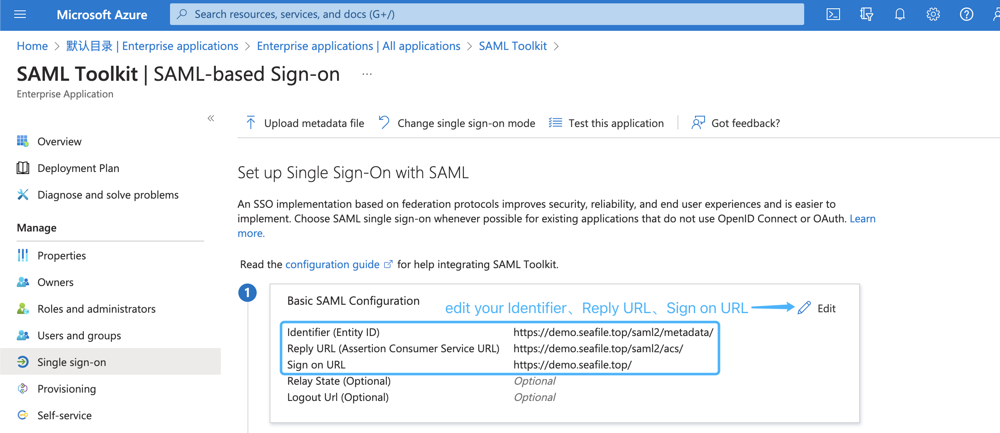

# SAML 2.0 in version 10.0

In this document, we use Microsoft Azure SAML single sign-on app to show how Seafile integrate SAML 2.0. Other SAML 2.0 provider should be similar.

## Preparations for SAML 2.0

**First**, install xmlsec1 package:

```
$ apt update
$ apt install xmlsec1
```

**Second**, prepare SP(Seafile) certificate directory and SP certificates:

Create certs dir

```
$ mkdir -p /opt/seafile/seahub-data/certs
```

The SP certificate can be generated by the openssl command, or you can apply to the certificate manufacturer, it is up to you. For example, generate the SP certs using the following command:

```
$ cd /opt/seafile/seahub-data/certs
$ openssl req -x509 -nodes -days 3650 -newkey rsa:2048 -keyout sp.key -out sp.crt
```

__Note__: The `days` option indicates the validity period of the generated certificate. The unit is day. The system admin needs to update the certificate regularly.

## Integration with Microsoft Azure SAML single sign-on app

**First**, add SAML single sign-on app and assign users, refer to: [add an Azure AD SAML application](https://docs.microsoft.com/en-us/azure/active-directory/manage-apps/add-application-portal), [create and assign users](https://docs.microsoft.com/en-us/azure/active-directory/manage-apps/add-application-portal-assign-users).

**Second**, setup the _Identifier_, _Reply URL_, and _Sign on URL_ of the SAML app based on your service URL, refer to: [enable single sign-on for saml app](https://learn.microsoft.com/en-us/azure/active-directory/manage-apps/add-application-portal-setup-sso). The format of the _Identifier_, _Reply URL_, and _Sign on URL_ are: https://example.com/saml2/metadata/, https://example.com/saml2/acs/, https://example.com/, e.g.:



**Next**, [edit saml attributes & claims](https://learn.microsoft.com/en-us/azure/active-directory/develop/saml-claims-customization). Keep the default attributes & claims of SAML app unchanged, the _uid_ attribute must be added, the _mail_ and _name_ attributes are optional, e.g.:


**Next**, download the base64 format SAML app's certificate and rename to idp.crt:


and put it under the certs directory(`/opt/seafile/seahub-data/certs`).

**Next**, copy the metadata URL of the SAML app:


and paste it into the `SAML_REMOTE_METADATA_URL` option in seahub_settings.py, e.g.:

```python
SAML_REMOTE_METADATA_URL = 'https://login.microsoftonline.com/xxx/federationmetadata/2007-06/federationmetadata.xml?appid=xxx'   # copy from SAML app
```

**Next**, add `ENABLE_ADFS_LOGIN`, `LOGIN_REDIRECT_URL` and `SAML_ATTRIBUTE_MAPPING` options to seahub_settings.py, and then restart Seafile, e.g:

```python
ENABLE_ADFS_LOGIN = True
LOGIN_REDIRECT_URL = '/saml2/complete/'
SAML_ATTRIBUTE_MAPPING = {
    'name': ('display_name', ),
    'mail': ('contact_email', ),
    ...
}
SAML_REMOTE_METADATA_URL = 'https://login.microsoftonline.com/xxx/federationmetadata/2007-06/federationmetadata.xml?appid=xxx'   # copy from SAML app
```

__Note__: If the xmlsec1 binary is **not located in** `/usr/bin/xmlsec1`, you need to add the following configuration in seahub_settings.py:

```python
SAML_XMLSEC_BINARY_PATH = '/path/to/xmlsec1'
```

View where the xmlsec1 binary is located:

```
$ which xmlsec1
```

__Note__: If certificates are **not placed in** `/opt/seafile/seahub-data/certs`, you need to add the following configuration in seahub_settings.py:

```python
SAML_CERTS_DIR = '/path/to/certs'
```

**Finally**, open the browser and enter the Seafile login page, click `Single Sign-On`, and use the user assigned to SAML app to perform a SAML login test.
