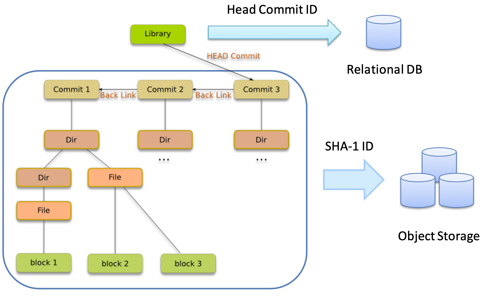

# Data Model

Seafile internally uses a data model similar to GIT's. It consists of `Repo`, `Commit`, `FS`, and `Block`.

Seafile's high performance comes from the architectural design: stores file metadata in object storage (or file system), while only stores small amount of metadata about the libraries in relational database. An overview of the architecture can be depicted as below. We'll describe the data model in more details.

## Repo

A repo is also called a library. Every repo has an unique id (UUID), and attributes like description, creator, password.

The metadata for a repo is stored in `seafile_db` database and the commit objects (see description in later section).

There are a few tables in the `seafile_db` database containing important information about each repo.

* `Repo`: contains the ID for each repo.
* `RepoOwner`: contains the owner id for each repo.
* `RepoInfo`: it is a "cache" table for fast access to repo metadata stored in the commit object. It includes repo name, update time, last modifier.
* `RepoSize`: the total size of all files in the repo.
* `RepoFileCount`: the file count in the repo.
* `RepoHead`: contains the "head commit ID". This ID points to the head commit in the storage, which will be described in the next section.

## Commit

Commit objects save the change history of a repo. Each update from the web interface, or sync upload operation will create a new commit object. A commit object contains the following information: commit ID, library name, creator of this commit (a.k.a. the modifier), creation time of this commit (a.k.a. modification time), root fs object ID, parent commit ID.

The root fs object ID points to the root FS object, from which we can traverse a file system snapshot for the repo.

The parent commit ID points to the last commit previous to the current commit. The `RepoHead` table contains the latest head commit ID for each repo. From this head commit, we can traverse the repo history.

If you use file system as storage backend, commit objects are stored in the path `seafile-data/storage/commits/<repo_id>`. If you use object storage, commit objects are stored in the `commits` bucket.

## FS

There are two types of FS objects, `SeafDir Object` and `Seafile Object`. `SeafDir Object` represents a directory, and `Seafile Object` represents a file.

The `SeafDir` object contains metadata for each file/sub-folder, which includes name, last modification time, last modifier, size, and object ID. The object ID points to another `SeafDir` or `Seafile` object. The `Seafile` object contains a block list, which is a list of block IDs for the file.

The FS object IDs are calculated based on the contents of the object. That means if a folder or a file is not changed, the same objects will be reused across multiple commits. This allow us to create snapshots very efficiently.

If you use file system as storage backend, commit objects are stored in the path `seafile-data/storage/fs/<repo_id>`. If you use object storage, commit objects are stored in the `fs` bucket.

## Block

A file is further divided into blocks with variable lengths. We use Content Defined Chunking algorithm to
divide file into blocks. A clear overview of this algorithm can be found at http://pdos.csail.mit.edu/papers/lbfs:sosp01/lbfs.pdf.
On average, a block's size is around 8MB.

This mechanism makes it possible to deduplicate data between different versions of frequently updated files,
improving storage efficiency. It also enables transferring data to/from multiple servers in parallel.

If you use file system as storage backend, commit objects are stored in the path `seafile-data/storage/blocks/<repo_id>`. If you use object storage, commit objects are stored in the `blocks` bucket.

## Virtual Repo

A "virtual repo" is a special repo that will be created in the cases below:

* A folder in a library is shared.
* A folder in a library is synced selectively from the sync client.

A virtual repo can be understood as a view for part of the data in its parent library. For example, when sharing a folder, the virtual repo only provides access to the shared folder in that library. Virtual repo use the same underlying data as the parent library. So virtual repos use the same `fs` and `blocks` storage location as its parent.

Virtual repo has its own change history. So it has separate `commits` storage location from its parent. The changes in virtual repo and its parent repo will be bidirectional merged. So that changes from each side can be seen from another.

There is a `VirtualRepo` table in `seafile_db` database. It contains the folder path in the parent repo for each virtual repo.
