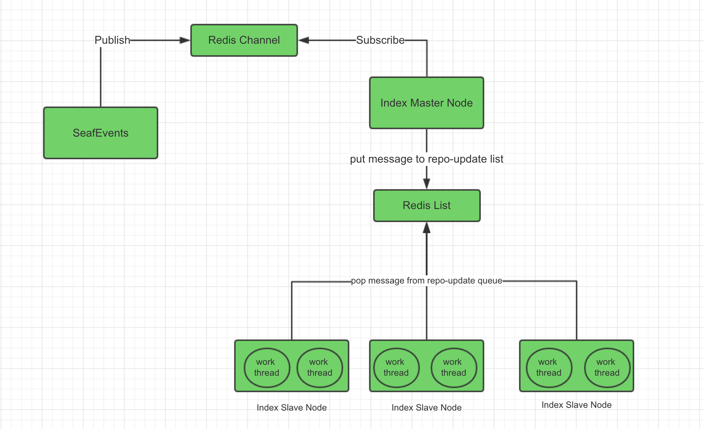

# Distributed indexing

If you use a cluster to deploy Seafile, you can use distributed indexing to realize real-time indexing and improve indexing efficiency. The indexing process is as follows:




## Prepare for distributed indexing

Distributed indexing requires using Redis as cache server instead of Memcached.

### Disable existing indexing

To use distributed indexing, you have to first disable existing single node indexing.

Modify the `seafevents.conf` on the backend node

```
[INDEX FILES]
enabled=true
     |
     V
enabled=false   
```

### Restart Seafile

=== "Deploy in Docker"
    ```sh
    docker exec -it seafile bash
    cd /scripts
    ./seafile.sh restart && ./seahub.sh restart
    ```
=== "Deploy from binary packages"
    ```sh
    cd /opt/seafile/seafile-server-latest
    ./seafile.sh restart && ./seahub.sh restart
    ```

## Deploy distributed indexing

First, prepare a index-server master node and several index-server slave nodes, the number of slave nodes depends on your needs. Copy the `seafile.conf` and the `seafevents.conf` in the `conf` directory from the Seafile frontend nodes to `/opt/seafile-data/seafile/conf` in index-server nodes. The master node and slave nodes need to read the configuration files to obtain the necessary information.

```bash
mkdir -p /opt/seafile-data/seafile/conf
mkdir -p /opt/seafile
```

Then download `.env` and `index-server.yml` to `/opt/seafile` in all index-server nodes.

```bash
cd /opt/seafile
wget https://manual.seafile.com/13.0/repo/docker/index-server/index-server.yml
wget -O .env https://manual.seafile.com/13.0/repo/docker/index-server/env
```

Modify mysql configurations in `.env`.

```env
SEAFILE_MYSQL_DB_HOST=<your mysql host>
SEAFILE_MYSQL_DB_PORT=3306
SEAFILE_MYSQL_DB_USER=seafile
SEAFILE_MYSQL_DB_PASSWORD=PASSWORD

REDIS_HOST=<your redis host>
REDIS_PORT=6379
REDIS_PASSWORD=

CLUSTER_MODE=master
```

!!! note
    CLUSTER_MODE needs to be configured as `master` on the master node, and needs to be configured as `worker` on the slave nodes.

Next, create a configuration file `index-master.conf` in the `conf` directory of the master node, e.g.

```conf
[DEFAULT]
interval=600
```

Start master node.

```bash
docker compose up -d
```

Next, create a configuration file `index-worker.conf` in the `conf` directory of all slave nodes, e.g.

```conf
[DEFAULT]
index_workers=2
```

Start all slave nodes.

```bash
docker compose up -d
```

## Some commands in distributed indexing

Rebuild search index, first execute the command in the Seafile node:

```bash
cd /opt/seafile/seafile-server-last/
./pro/pro.py search --clear
```

Then execute the command in the index-server master node:

```bash
docker exec -it index-server bash
/opt/seafile/index-server/index-server.sh restore-all-repo
```

List the number of indexing tasks currently remaining, execute the command in the index-server master node:

```bash
/opt/seafile/index-server/index-server.sh show-all-task
```
