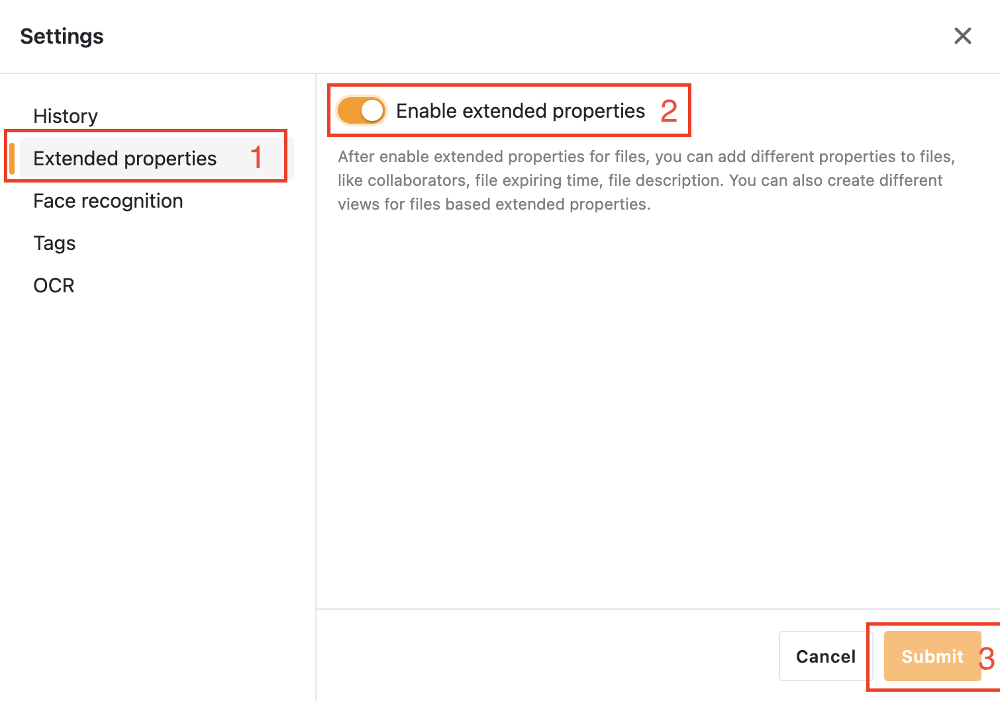
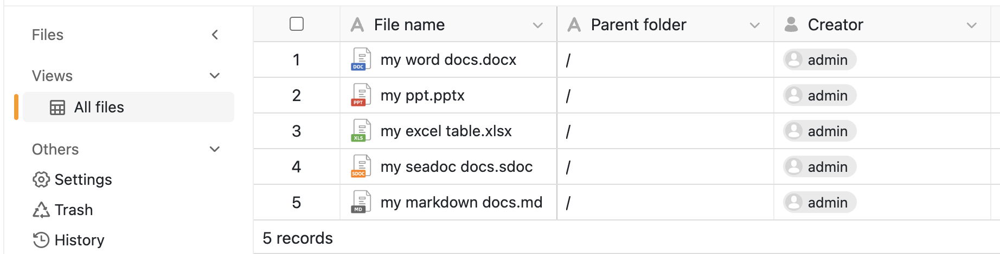

# Metadata server

Metadata server aims to provide metadata management for your libraries, so as to better understand the relevant information of your libraries.

## Deployment

!!! note "Prerequisites"
    The startup of Metadata server requires using ***Redis*** as the cache server (it should be the default cache server in Seafile 13.0). So you must deploy *Redis* for Seafile, then modify [`seafile.conf`](../config/seafile-conf.md#cache-pro-edition-only), [`seahub_settings.py`](https://docs.djangoproject.com/en/4.2/topics/cache/#redis) and [`seafevents.conf`](../config/seafevents-conf.md) to enable it before deploying metadata server.

!!! warning
    Please make sure your Seafile service has been deployed **before** deploying Metadata server. This is because Metadata server needs to read Seafile's configuration file `seafile.conf`. If you deploy Metadata server before or at the same time with Seafile, it may not be able to detect `seafile.conf` and fail to start.

### Download docker-compose file

Please download the file by following command:

=== "Deploy in the same machine with Seafile"

    !!! note
        You have to download this file to the directory same as `seafile-server.yml`

    ```sh
    wget https://manual.seafile.com/13.0/repo/docker/md-server.yml
    ```

=== "Standalone"

    !!! note
        For standalone deployment (usually used in cluster deployment), the metadata server only supports Seafile using the storage backend such as **S3**. 

    ```sh
    wget https://manual.seafile.com/13.0/repo/docker/metadata-server/md-server.yml
    wget -O .env https://manual.seafile.com/13.0/repo/docker/metadata-server/env
    ```

### Modify `.env`

Metadata server read all configurations from environtment and **does not need a dedicated configuration file**, and you don't need to add additional variables to your `.env` (except for standalone deployment) to get the metadata server started, because it will read the exact same configuration as the Seafile server (including `JWT_PRIVATE_KEY` ) and keep the repository metadata locally (default `/opt/seafile-data/seafile/md-data`). But you still need to modify the `COMPOSE_FILE` list in `.env`, and add `md-server.yml` to enable the metadata server:

```
COMPOSE_FILE='...,md-server.yml'
```

To facilitate your deployment, we still provide two different configuration solutions for your reference:

#### Example `.env` for Seafile data is stored locally

In this case you don't need to add any additional configuration to your `.env`. You can also specify image version, maximum local cache size, etc.

```
MD_IMAGE=seafileltd/seafile-md-server:latest
MD_MAX_CACHE_SIZE=1GB
```

#### Example `.env` for  Seafile data is stored in the storage backend (e.g., S3)

First you need to create a bucket for metadata on your S3 storage backend provider. Then add or modify the following information to `.env`:

```sh
MD_IMAGE=seafileltd/seafile-md-server:latest
MD_STORAGE_TYPE=s3
S3_MD_BUCKET=...
S3_KEY_ID=<your-key-id>
S3_SECRET_KEY=<your-secret-key>
S3_USE_V4_SIGNATURE=true
S3_PATH_STYLE_REQUEST=false
S3_AWS_REGION=us-east-1
S3_HOST=
S3_USE_HTTPS=true
S3_SSE_C_KEY=
```

!!! note "Data for Seafile server should be accessible for Metadata server"
    In order to correctly obtain metadata information, you must ensure that the data of your Seafile server can be correctly accessed. In the case of deploying Metadata server and Seafile server together, Metadata server will be able to automatically obtain the configuration information of Seafile server, so you don't need to worry about this. But if your Metadata server is deployed in Standalone (usually in a cluster environment), then you need to ensure that the description of the Seafile server storage part in the `.env` deployed by Metadata server needs to be consistent with the `.env` deployed by Seafile server (e.g., `SEAF_SERVER_STORAGE_TYPE`), and can access the configuration file information of Seafile server (e.g., `seafile.conf`) to ensure that Metadata server can correctly obtain data from Seafile server.

#### List of environment variables for Metadata server
The following table is all the related environment variables with Metadata server:

| Variables           | Description                                                                                                                | Required |
| --- | --- | --- |
| `JWT_PRIVATE_KEY`   | The JWT key used to connect with Seafile server | **Required** |
| `MD_MAX_CACHE_SIZE` | The maximum cache size.                                                                                                    | Optional, default `1GB`            |
| `REDIS_HOST`        | Your *Redis* service host.                                                                                                 | Optional, default `redis`          |
| `REDIS_PORT`        | Your *Redis* service port.                                                                                                 | Optional, default `6379`           |
| `REDIS_PASSWORD`    | Your *Redis* access password.                                                                                              | Optional                |
| `MD_STORAGE_TYPE`    | Where the metadata storage in. Available options are `disk` (local storage) and `s3` | `disk` |
| `S3_MD_BUCKET`    | Your S3 bucket name for the bucket storing metadata | Required when using S3 (`MD_STORAGE_TYPE=s3`) |
| `MD_CHECK_UPDATE_INTERVAL`    | The interval for updating metadata of the repository | `30m` |
| `MD_FILE_COUNT_LIMIT` | The maximum number of files in a repository that the metadata feature allows. If the number of files in a repository exceeds this value, the metadata management function will not be enabled for the repository. For a repository with metadata management enabled, if the number of records in it reaches this value but there are still some files that are not recorded in metadata server, the metadata management of the unrecorded files will be skipped. | `100000` |

In addition, there are some environment variables **related to S3 authorization**, please refer to the part with `S3_` prefix in this [table](../setup/setup_pro_by_docker.md#downloading-and-modifying-env) (**the buckets name for Seafile are also needed**).

!!! warning "Metadata server supports *Redis* only"
    To enable metadata feature, you have to use *Redis* for cache, as the `CACHE_PROVIDER` must be set to `redis` in your `.env`

### Modify `seahub_settings.py`

To enable metadata server in Seafile, please add the following field in your `seahub_settings.py`:

=== "Deploy in the same machine with Seafile"
    ```py
    ENABLE_METADATA_MANAGEMENT = True
    METADATA_SERVER_URL = 'http://seafile-md-server:8084'
    ```
=== "Standalone"
    ```py
    ENABLE_METADATA_MANAGEMENT = True
    METADATA_SERVER_URL = 'http://<your metadata-server host>:8084'
    ```

## Start service

You can use following command to start metadata server (and the Seafile service also have to restart):

```sh
docker compose down
docker compose up -d
```

## Verify Metadata server and enable it in the Seafile

1. Check container log for `seafile-md-server`, you can see the following message if it runs fine:

    ```
    $docker logs -f seafile-md-server

    [md-server] [2025-03-27 02:30:55] [INFO] Created data links
    [md-server] [2025-03-27 02:30:55] [INFO] Database initialization completed
    [md-server] [2025-03-27 02:30:55] [INFO] Starting Metadata server
    ```
2. Check the `seafevents.log` and `seahub.log`, as you can see the following information in `seafevents.log` and **no error log** is reported in `seahub.log`:

    ```log
    [2025-02-23 06:08:05] [INFO] seafevents.repo_metadata.index_worker:134 refresh_lock refresh_thread Starting refresh locks
    [2025-02-23 06:08:05] [INFO] seafevents.repo_metadata.slow_task_handler:61 worker_handler slow_task_handler_thread_0 starting update metadata work
    [2025-02-23 06:08:05] [INFO] seafevents.repo_metadata.slow_task_handler:61 worker_handler slow_task_handler_thread_1 starting update metadata work
    [2025-02-23 06:08:05] [INFO] seafevents.repo_metadata.slow_task_handler:61 worker_handler slow_task_handler_thread_2 starting update metadata work
    ```

3. Switch ***Enable extended properties*** in button ***Settings***

    

3. Finally, you can see the metadata of your library in ***views*** tab

    

## Directory structure

When you deploy Seafile server and Metadata server to the **same machine**, Metadata server will use the same persistence directory (e.g. /opt/seafile-data) as Seafile server. Metadata server will use the following directories or files:

- `/opt/seafile-data/seafile/md-data`: Metadata server data and cache
- `/opt/seafile-data/seafile/logs/seaf-md-server`: The logs directory of Metadata server, consist of a running log and an access log.
