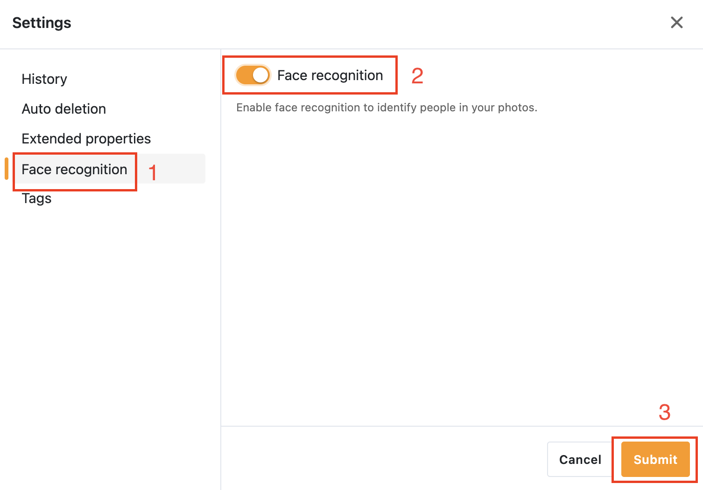

# Seafile AI extension

From Seafile 13, users can enable ***Seafile AI*** to support the following features:

!!! note "Prerequisites of Seafile AI deployment"
    To deploy Seafile AI, you have to deploy [metadata server](./metadata-server.md) extension firstly. Then you can follow this manual to deploy Seafile AI.

- File tags, file and image summaries, text translation, sdoc writing assistance
- Given an image, generate its corresponding tags (including objects, weather, color, etc.)
- Detect faces in images and encode them
- Detect text in images (OCR)

!!! danger "AIGC statement in Seafile"
    With the help of large language models and face recognition models and algorithm development, Seafile AI supports image recognition and text generation. The generated content is **diverse** and **random**, and users need to identify the generated content. **Seafile will not be responsible for AI-generated content (AIGC)**.

    At the same time, Seafile AI supports the use of custom LLM and face recognition models. Different large language models will have different impacts on AIGC (including functions and performance), so **Seafile will not be responsible for the corresponding rate (i.e., tokens/s), token consumption, and generated content**. Including but not limited to

    - Basic model (including model basic algorithm)
    - Parameter quantity
    - Quantization level

    When users use their own OpenAI-compatibility-API LLM service (e.g., *LM studio*, *Ollama*) and use self-ablated or abliterated models, **Seafile will not be responsible for possible bugs** (such as infinite loops outputting the same meaningless content). At the same time, Seafile does not recommend using documents such as SeaDoc to evaluate the performance of ablated models.

## Deploy Seafile AI basic service

### Deploy Seafile AI on the host with Seafile

The Seafile AI basic service will use API calls to external large language model service to implement file labeling, file and image summaries, text translation, and sdoc writing assistance.

!!! warning "Seafile AI requires Redis cache"
    In order to deploy Seafile AI correctly, you have to use ***Redis*** as the cache. Please set `CACHE_PROVIDER=redis` in `.env` and set Redis related configuration information correctly.

1. Download `seafile-ai.yml`

    ```sh
    wget https://manual.seafile.com/14.0/repo/docker/seafile-ai.yml
    ```

2. Modify `.env`, insert or modify the following fields:

    === "OpenAI"

        ```
        COMPOSE_FILE='...,seafile-ai.yml' # add seafile-ai.yml

        ENABLE_SEAFILE_AI=true
        SEAFILE_AI_LLM_TYPE=openai
        SEAFILE_AI_LLM_KEY=<your openai LLM access key>
        SEAFILE_AI_LLM_MODEL=gpt-4o-mini # recommend
        ```
    === "Google AI studio"

        ```
        COMPOSE_FILE='...,seafile-ai.yml' # add seafile-ai.yml

        ENABLE_SEAFILE_AI=true
        SEAFILE_AI_LLM_TYPE=gemini
        SEAFILE_AI_LLM_KEY=<your openai LLM access key>
        SEAFILE_AI_LLM_MODEL=gemini-3-flash-preview # recommend
        ```
    === "Deepseek"
        ```
        COMPOSE_FILE='...,seafile-ai.yml' # add seafile-ai.yml

        ENABLE_SEAFILE_AI=true
        SEAFILE_AI_LLM_TYPE=deepseek
        SEAFILE_AI_LLM_KEY=<your LLM access key>
        SEAFILE_AI_LLM_MODEL=deepseek-chat # recommend
        ```
    === "Azure OpenAI"
        ```
        COMPOSE_FILE='...,seafile-ai.yml' # add seafile-ai.yml

        ENABLE_SEAFILE_AI=true
        SEAFILE_AI_LLM_TYPE=azure
        SEAFILE_AI_LLM_URL= # your deployment url, leave blank to use default endpoint
        SEAFILE_AI_LLM_KEY=<your API key>
        SEAFILE_AI_LLM_MODEL=<your deployment name>
        ```
    === "Ollama"
        ```
        COMPOSE_FILE='...,seafile-ai.yml' # add seafile-ai.yml

        ENABLE_SEAFILE_AI=true
        SEAFILE_AI_LLM_TYPE=ollama
        SEAFILE_AI_LLM_URL=<your LLM endpoint>
        SEAFILE_AI_LLM_KEY=<your LLM access key>
        SEAFILE_AI_LLM_MODEL=<your model-id>
        ```
    === "HuggingFace"
        ```
        COMPOSE_FILE='...,seafile-ai.yml' # add seafile-ai.yml

        ENABLE_SEAFILE_AI=true
        SEAFILE_AI_LLM_TYPE=huggingface
        SEAFILE_AI_LLM_URL=<your huggingface API endpoint>
        SEAFILE_AI_LLM_KEY=<your huggingface API key>
        SEAFILE_AI_LLM_MODEL=<model provider>/<model-id>
        ```
    === "Other"
        Seafile AI utilizes [LiteLLM](https://docs.litellm.ai/docs/) to interact with LLM services. For a complete list of supported LLM providers, please refer to [this documentation](https://docs.litellm.ai/docs/providers). Then fill the following fields in your `.env`:

        ```
        COMPOSE_FILE='...,seafile-ai.yml' # add seafile-ai.yml
        ENABLE_SEAFILE_AI=true

        # according to your situation
        SEAFILE_AI_LLM_TYPE=...
        SEAFILE_AI_LLM_URL=...
        SEAFILE_AI_LLM_KEY=...
        SEAFILE_AI_LLM_MODEL=...
        ```

        For example, if you are using a LLM service with ***OpenAI-compatible endpoints***, you should set `SEAFILE_AI_LLM_TYPE` to `other`, and set other LLM configuration items accurately.

            
    !!! note "About model selection"

        Seafile AI supports using large model providers from [LiteLLM](https://docs.litellm.ai/docs/providers) or large model services with OpenAI-compatible endpoints. Therefore, Seafile AI is compatible with most custom large model services except the default model (*gpt-4o-mini*), but in order to ensure the normal use of Seafile AI features, you need to select a **multimodal large model** (such as supporting image input and recognition)


3. Restart Seafile server:

    ```sh
    docker compose down
    docker compose up -d
    ```

### Deploy Seafile AI on another host to Seafile

1. Download `seafile-ai.yml` and `.env`:

    ```sh
    wget https://manual.seafile.com/14.0/repo/docker/seafile-ai/seafile-ai.yml
    wget -O .env https://manual.seafile.com/14.0/repo/docker/seafile-ai/env
    ```

2. Modify `.env` on the host where Seafile AI will be deployed. The environment variables used by `seafile-ai.yml` are described below. Variables with a default value can be omitted unless you need to override the default.

    Service and connection settings:

    | Variable | Description |
    |----------|-------------|
    | `SEAFILE_AI_IMAGE` | Seafile AI image. Default is `seafileltd/seafile-ai:14.0-latest`. |
    | `SEAFILE_VOLUME` | Seafile data directory mounted at `/shared` in the container. Default is `/opt/seafile-data`. |
    | `INNER_SEAHUB_SERVICE_URL` | URL used by Seafile AI to access Seahub, for example `http://<your Seafile server intranet IP>`. This variable is required for a standalone deployment. |
    | `INNER_METADATA_SERVER_URL` | URL used by Seafile AI to access the metadata server, for example `http://<your metadata server intranet IP>:8084`. |
    | `SEASEARCH_URL` | URL used by Seafile AI to access SeaSearch, for example `http://<your SeaSearch server intranet IP>:4080`. Leave it empty if SeaSearch is not used. |
    | `SEASEARCH_TOKEN` | SeaSearch API authorization token. It is the Base64 encoding of the SeaSearch administrator's `username:password`. |
    | `JWT_PRIVATE_KEY` | JWT key shared with the Seafile server and related extension services. This variable is required. |
    | `SEAFILE_AI_LOG_LEVEL` | Seafile AI log level. Default is `info`. |

    LLM and face recognition settings:

    | Variable | Description |
    |----------|-------------|
    | `SEAFILE_AI_LLM_TYPE` | LLM provider type. Default is `openai`. |
    | `SEAFILE_AI_LLM_URL` | LLM API endpoint. Leave it empty to use the provider's default endpoint. |
    | `SEAFILE_AI_LLM_KEY` | LLM API key. |
    | `SEAFILE_AI_LLM_MODEL` | LLM model ID or name. Default is `gpt-4o-mini`. |
    | `FACE_EMBEDDING_SERVICE_URL` | URL used to access the face embedding service. Leave it empty if face recognition is not used. |
    | `FACE_EMBEDDING_SERVICE_KEY` | Authentication key for the face embedding service. By default, it uses `JWT_PRIVATE_KEY`. |

    Database and cache settings:

    | Variable | Description |
    |----------|-------------|
    | `SEAFILE_MYSQL_DB_HOST` | Seafile database host. Default is `db`. |
    | `SEAFILE_MYSQL_DB_PORT` | Seafile database port. Default is `3306`. |
    | `SEAFILE_MYSQL_DB_USER` | Seafile database user. Default is `seafile`. |
    | `SEAFILE_MYSQL_DB_PASSWORD` | Seafile database password. This variable is required. |
    | `SEAFILE_MYSQL_DB_CCNET_DB_NAME` | CCNet database name. Default is `ccnet_db`. |
    | `SEAFILE_MYSQL_DB_SEAFILE_DB_NAME` | Seafile database name. Default is `seafile_db`. |
    | `SEAFILE_MYSQL_DB_SEAHUB_DB_NAME` | Seahub database name. Default is `seahub_db`. |
    | `CACHE_PROVIDER` | Cache provider. Seafile AI requires Redis, so this must be `redis`. |
    | `REDIS_HOST` | Redis server host. Default is `redis`. |
    | `REDIS_PORT` | Redis server port. Default is `6379`. |
    | `REDIS_PASSWORD` | Redis server password. Leave it empty if authentication is disabled. |

    Storage settings:

    | Variable | Description |
    |----------|-------------|
    | `SEAF_SERVER_STORAGE_TYPE` | Storage type used by the Seafile server. Use the same value as in the Seafile server configuration. |
    | `S3_COMMIT_BUCKET` | S3 bucket that stores commit objects. |
    | `S3_FS_BUCKET` | S3 bucket that stores file-system objects. |
    | `S3_BLOCK_BUCKET` | S3 bucket that stores block objects. |
    | `S3_KEY_ID` | S3 access key ID. |
    | `S3_SECRET_KEY` | S3 secret access key. |
    | `S3_USE_V4_SIGNATURE` | Whether to use AWS Signature Version 4. Default is `true`. |
    | `S3_AWS_REGION` | S3 region. Default is `us-east-1`. |
    | `S3_HOST` | S3-compatible service endpoint. Leave it empty when using the default AWS endpoint. |
    | `S3_USE_HTTPS` | Whether to use HTTPS to access S3. Default is `true`. |
    | `S3_PATH_STYLE_REQUEST` | Whether to use path-style S3 requests. Default is `false`. |
    | `S3_SSE_C_KEY` | Optional customer-provided key for S3 server-side encryption (SSE-C). |

    then start your Seafile AI server:

    ```sh
    docker compose up -d
    ```

3. Modify `.env` in the host deployed Seafile

    ```env
    SEAFILE_AI_SERVER_URL=http://<your seafile ai host>:8888
    ```

    then restart your Seafile server

    ```sh
    docker compose down && docker compose up -d
    ```

## Deploy face embedding service (Optional)

The face embedding service is used to detect and encode faces in images and is an extension component of Seafile AI. Generally, we **recommend** that you deploy the service on a machine with a **GPU** and a graphics card driver that supports [OnnxRuntime](https://onnxruntime.ai/docs/) (so it can also be deployed on a different machine from the Seafile AI base service). Currently, the Seafile AI face embedding service only supports the following modes:

- *Nvidia* GPU, which will use the ***CUDA 12.4*** acceleration environment (at least the minimum Nvidia Geforce 531.18 driver) and requires the installation of the [Nvidia container toolkit](https://docs.nvidia.com/datacenter/cloud-native/container-toolkit/latest/install-guide.html).
<!-- - *AMD* GPU, which will use the ***ROCm 6.4.1*** acceleration environment.-->
- Pure *CPU* mode

If you plan to deploy these face embeddings in an environment using a GPU, you need to make sure your graphics card is **in the range supported by the acceleration environment** (e.g., CUDA 12.4 is supported) and **correctly mapped in `/dev/dri` directory**. So in some case, the cloud servers and [WSL](https://learn.microsoft.com/en-us/windows/wsl/install) under some driver versions may not be supported.

1. Download Docker compose files

    === "CUDA"

        ```sh
        wget -O face-embedding.yml https://manual.seafile.com/14.0/repo/docker/face-embedding/cuda.yml
        ```
    === "CPU"

        ```sh
        wget -O face-embedding.yml https://manual.seafile.com/14.0/repo/docker/face-embedding/cpu.yml
        ```
    
<!--
    === "ROCM"

        ```sh
        wget -O face-embedding.yml https://manual.seafile.com/14.0/repo/docker/face-embedding/rocm.yml
        ```
-->

2. Modify `.env`, insert or modify the following fields:

    ```
    COMPOSE_FILE='...,face-embedding.yml' # add face-embedding.yml

    FACE_EMBEDDING_VOLUME=/opt/face_embedding
    ```

3. Restart Seafile server

    ```sh
    docker compose down
    docker compose up -d
    ```

4. Enable face recognition in the repo's settings:

    

### Deploy the face embedding service on a different machine than the Seafile AI basic service

Since the face embedding service may need to be deployed on some hosts with GPU(s), it may not be deployed together with the Seafile AI basic service. At this time, you should make some changes to the Docker compose file so that the service can be accessed normally.

1. Modify `.yml` file, delete the commented out lines to expose the service port:

    ```yml
    services:
        face-embedding:
        ...
        ports:
            - 8886:8886
    ```

2. Modify the `.env` of where deployed Seafile server:

    ```env
    ENABLE_FACE_RECOGNITION=true
    ```


3. Modify the `.env` of where deployed Seafile AI:

    ```env
    FACE_EMBEDDING_SERVICE_URL=http://<your face embedding service host>:8886
    ```

4. Make sure `JWT_PRIVATE_KEY` has set in the `.env` for face embedding and is same as the Seafile server

5. Restart Seafile server and Seafile-AI server

    ```sh
    docker compose down
    docker compose up -d
    ```

### Persistent volume and model management

By default, the persistent volume is `/opt/face_embedding`. It will consist of two subdirectories:

- `/opt/face_embedding/logs`: Contains the startup log and access log of the face embedding
- `/opt/face_embedding/models`: Contains the model files of the face embedding. It will automatically obtain the latest applicable models at each startup. These models are hosted by [our Hugging Face repository](https://huggingface.co/Seafile/face-embedding). Of course, you can also manually download your own models on this directory (**If you fail to automatically pull the model, you can also manually download it**).

### Customizing model serving access keys

By default, the access key used by the face embedding is the same as that used by the Seafile server, which is `JWT_PRIVATE_KEY`. At some point, this will have to be modified for security reasons. If you need to customize the access key for the face embedding, you can do the following steps:

1. Modify `.env` file for both face embedding and Seafile AI:

    ```
    FACE_EMBEDDING_SERVICE_KEY=<your customizing access keys>
    ```
    
2. Restart Seafile server

    ```sh
    docker compose down
    docker compose up -d
    ```

## Advanced operations

### Enable AI usage statistics

Seafile supports counting users' AI usage (how many tokens are used) and setting monthly AI quotas for users.

1. Open `$SEAFILE_VOLUME/seafile/conf/seahub_settings.py` and add AI prices (i.e., how much per token) informations:

    ```py
    AI_PRICES = {
    "gpt-4o-mini": { # replace gpt-4o-mini to your model name
        "input_tokens_1k": 0.0011, # input price per token
        "output_tokens_1k": 0.0044 # output price per token
        }
    }
    ```

2. Refer management of [roles and permission](../config/roles_permissions.md) to specify `monthly_ai_credit_per_user` (`-1` is unlimited), and the unit should be the same as in `AI_PRICES`.

    !!! note "`monthly_ai_credit_per_user` for organization user"
        For organizational team users, `monthly_ai_credit_per_user` will apply to the entire team. For example, when `monthly_ai_credit_per_user` is set to `2` (unit of doller for example) and there are 10 members in the team, all members in the team will share the quota of $2\times10=20\$$.

### Enable AI chat and configure multiple models

Seafile AI chat is disabled by default. To enable it, you need to configure Seahub. Configuring multiple models in `seafile_ai_config.yaml` is optional and is only needed when you want to provide selectable models in the chat dialog.

1. Open `$SEAFILE_VOLUME/seafile/conf/seahub_settings.py` and enable AI chat:

    ```py
    ENABLE_AI_CHAT = True
    ```

    After this option is enabled, Seahub will display the AI chat entry for users.

2. Optional: open `$SEAFILE_VOLUME/seafile/conf/seafile_ai_config.yaml` and configure one or more chat models under `global.LLM_MODELS`:

    ```yaml
    global:
      LLM_MODELS:
        - type: other
          url: http://<your-llm-endpoint>
          key: <your-api-key>
          model: gpt-5.4-nano
          label: gpt-5.4-nano
          default: false
          tier: high
          hidden: false
          disable: false
        - type: other
          url: http://<your-llm-endpoint>
          key: <your-api-key>
          model: gemini-3-flash-preview
          label: gemini-3-flash-preview
          default: true
          tier: high
          hidden: false
          disable: false
        - type: other
          url: http://<your-llm-endpoint>
          key: <your-api-key>
          model: deepseek-v4-pro
          label: deepseek-v4-pro
          default: false
          tier: high
          hidden: false
          disable: false
    ```

    The fields are described below:

    | Field | Description |
    |----------|-------------|
    | `type` | LLM provider type. For OpenAI-compatible endpoints, use `other`. |
    | `url` | The provider API endpoint. |
    | `key` | The API key used to access the model service. |
    | `model` | Model ID used in API calls. |
    | `label` | Model name shown in the AI chat model selector. |
    | `default` | Whether this model is the default selected model. Usually only one model should be set to `true`. |
    | `tier` | Model tier metadata used by Seafile AI. |
    | `hidden` | If `true`, the model will not be shown in Seahub's model selector. |
    | `disable` | If `true`, the model is disabled and should not be used for chat requests. |

    
    !!! note

        Configuring `seafile_ai_config.yaml` is optional. If it is not confitured, AI chat will use the model configured by the environment variables such as `SEAFILE_AI_LLM_TYPE`, `SEAFILE_AI_LLM_URL`, `SEAFILE_AI_LLM_KEY`, and `SEAFILE_AI_LLM_MODEL`.  In this case, Seahub will not show a model selector in the AI chat dialog.

    !!! note

        If Seafile and Seafile AI are deployed on separate machines, you need to configure `seafile_ai_config.yaml` on both machines. Seahub reads this file to display available models in the AI chat model selector, and the Seafile AI service reads the same file to route actual model requests.

    !!! note

        The model with `default: true` is not only the default model in AI chat, but is also used by general AI features such as file summary generation, writing assistant, and other non-chat AI functions.

3. Restart Seafile services to apply the changes:

    ```sh
    docker compose down
    docker compose up -d
    ```

    If Seafile AI is deployed on a separate host, restart both the Seafile server and the Seafile AI service.
