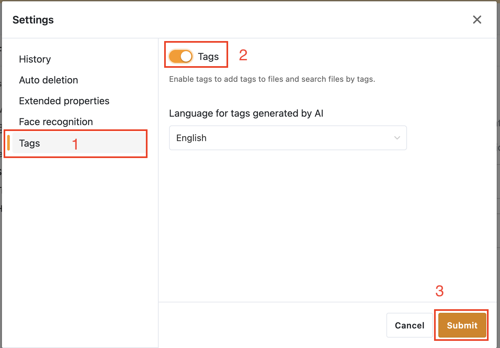
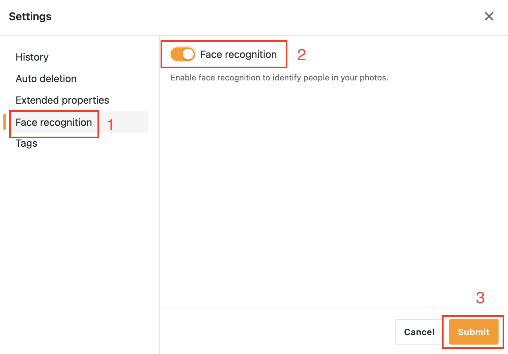

# Seafile AI extension (Pro)

From Seafile 13 Pro, users can enable ***Seafile AI*** to support the following features:

- File tags, file and image summaries, text translation, sdoc writing assistance
- Given an image, generate its corresponding tags (including objects, weather, color, etc.)
- Detect faces in images and encode them
- Detect text locations in images and recognize them

## Deploy Seafile AI basic service

The Seafile AI basic service will use API calls to external large language model service (e.g., *GPT-4o-mini*) to implement file labeling, file and image summaries, text translation, and sdoc writing assistance.

1. Download `seafile-ai.yml`

    ```sh
    wget https://manual.seafile.com/13.0/repo/docker/pro/seafile-ai.yml
    ```

    !!! note "Deploy in a cluster"

        If you deploy Seafile in a cluster and would like to deploy Seafile AI, please expose port `8888` in `seafile-ai.yml`:

        ```yml
        services:
          seafile-ai:
            ...
            ports:
              - 8888:8888
        ```

        At the same time, Seafile AI should be deployed on one of the cluster nodes.

2. Modify `.env`, insert or modify the following fields:

    ```
    COMPOSE_FILE='...,seafile-ai.yml' # add seafile-ai.yml

    ENABLE_SEAFILE_AI=true
    SEAFILE_AI_LLM_TYPE=open-ai
    SEAFILE_AI_LLM_URL=<your LLM endpoint URL>
    SEAFILE_AI_LLM_KEY=<your LLM access key>
    ```

    !!! note "Deploy in a cluster"
        Please also specify `SEAFILE_AI_SERVER_URL` to the host where deploys your Seafile AI basic service in `.env`, if you deploy Seafile in a cluster.

3. Restart Seafile server:

    ```sh
    docker compose down
    docker compose up -d
    ```

!!! tip
    Since the file tagging feature requires [deploying the metadata service](./metadata-server.md) first, the file tagging feature is not enabled by default. You can enable this feature in the repo's settings after enabling extension properties (see the figure below, it will only be enabled if you have management permissions for this repo).

    

## Seafile AI model services (Optional)

Seafile AI model services mainly include ***Face Embedding*** (used to detect and encode faces in images), ***Image Tags*** (used to produce labels for image files), and ***OCR*** (used to detect and recognize text locations in images). 

!!! tip "*Image Tags* and *OCR* services are still in progress"

Generally, we recommend that you deploy these services on a machine with a **GPU** (it can be deployed on a machine different from the one where Seafile AI basic services are deployed). Currently, Seafile AI model services support the use of *Nvidia* (using ***CUDA***) and *AMD* (using ***ROCM***) GPUs, and CPUs only. If you plan to deploy these model services in an environment using GPUs, you need to make sure your GPU is within the model range supported by the acceleration environment (such as CUDA or ROCM)

### Face Embedding

1. Download Docker compose files

    === "CUDA"

        ```sh
        wget -O face-embedding.yml https://manual.seafile.com/13.0/repo/docker/seafile-ai/face-embedding/cuda.yml
        ```
    
    === "ROCM"

        ```sh
        wget -O face-embedding.yml https://manual.seafile.com/13.0/repo/docker/seafile-ai/face-embedding/rocm.yml
        ```

    === "CPU"

        ```sh
        wget -O face-embedding.yml https://manual.seafile.com/13.0/repo/docker/seafile-ai/face-embedding/cpu.yml
        ```

2. Modify `.env`, insert or modify the following fields:

    ```
    COMPOSE_FILE='...,face-embedding.yml' # add face-embedding.yml

    FACE_EMBEDDING_VOLUME=/opt/face_embedding
    ```

3. Restart Seafile server

    ```sh
    docker compose down
    docker compose up -d
    ```

4. Enable face recognition in the repo's settings:

    

### Advanced options

#### Deploy the model service on a different machine than the Seafile AI basic service

Since the model service may need to be deployed on some hosts with GPU(s), it may not be deployed together with the Seafile AI basic service. At this time, you should make some changes to the Docker compose file so that the service can be accessed normally. Take *Face embedding* service as example, you need to

1. Modify `.yml` file, delete the commented out lines to expose the service port:

    ```yml
    services:
        face-embedding:
        ...
        ports:
            - 8886:8886
    ```

2. Modify the `.env` of the Seafile AI basic service:

    ```
    # donot forget to add the port number corresponding to the service at the end of the address, e.g., `8886` for face embedding
    FACE_EMBEDDING_SERVICE_URL=<your face embedding service URL>:8886
    ```

3. Make sure `JWT_PRIVATE_KEY` has set in the `.env` for model service and is same as the Seafile server

4. Restart Seafile server

    ```sh
    docker compose down
    docker compose up -d
    ```

#### Specify required version of CUDA or ROCM

You can specify a required version of CUDA or ROCM (note that this may also affect the version of the code) by specifying the model service image tag in `.env`, like 

=== "CUDA"

    ```
    FACE_EMBEDDING_IMAGE=seafileltd/face-embedding:cuda-12.8
    ```
=== "ROCM"
    ```
    FACE_EMBEDDING_IMAGE=seafileltd/face-embedding:rocm-6.4
    ```

#### Persistent volume and model management

By default, the persistent volume is `/opt/<model service>` (i.e., `/opt/face_embedding` for face embedding). It will consist of two subdirectories:

- `/opt/<model service>/logs`: Contains the startup log and access log of the model service
- `/opt/<model service>/models`: Contains the model files of the model service. It will automatically obtain the latest applicable models at each startup. These models are hosted by Hugging Face LFS. Of course, users also manually download their own model files before the first startup.

#### Customizing model serving access keys

By default, the access key used by the model service is the same as that used by the Seafile server, which is `JWT_PRIVATE_KEY`. At some point, this will have to be modified for security reasons. If you need to customize the access key for the model service, you can do the following steps:

1. Modify the `.yml` file for model service:

    ```yml
    services:
      face-embedding:
        environment:
        #  - FACE_EMBEDDING_SERVICE_KEY=${JWT_PRIVATE_KEY:?JWT_PRIVATE_KEY is not set or empty} # comment this line
          - FACE_EMBEDDING_SERVICE_KEY=$FACE_EMBEDDING_SERVICE_KEY # uncomment this line
    ```

2. Modify `.env` file for both model service and Seafile AI:

    ```
    FACE_EMBEDDING_SERVICE_KEY=<your customizing access keys>
    ```
    
3. Restart Seafile server

    ```sh
    docker compose down
    docker compose up -d
    ```
