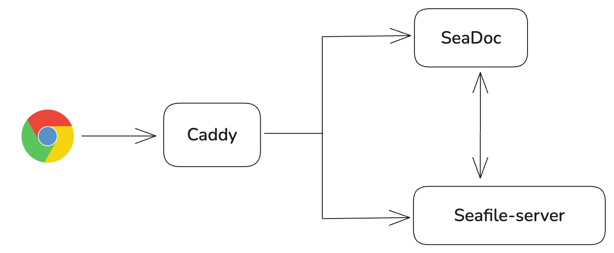

# SeaDoc Integration

SeaDoc is an extension of Seafile that providing an online collaborative document editor.

SeaDoc designed around the following key ideas:

* An expressive easy to use editor
* A review and approval workflow to better control how contents changes
* Inter-document linking for connecting related contents
* AI integration that streamlines content generation, summarization, and management
* Comprehensive APIs for automating document generating and processing

SeaDoc excels at:

* Authoring product and technical documents
* Creating knowledge base articles and online manuals
* Building internal Wikis

## Architecture

The SeaDoc archticture is demonstrated as below:



Here is the workflow when a user open sdoc file in browser

1. When a user open a sdoc file in the browser, a file loading request will be sent to Caddy, and Caddy proxy the request to SeaDoc server (see [Seafile instance archticture](../setup/overview.md) for the details).
2. SeaDoc server will send the file's content back if it is already cached, otherwise SeaDoc serve will sends a request to Seafile server.
3. Seafile server loads the content, then sends it to SeaDoc server and write it to the cache at the same time.
4. After SeaDoc receives the content, it will be sent to the browser.

## Deployment method

SeaDoc has the following deployment methods with different situations:

- **Situation 1**: Deploy SeaDoc server with the same host as Seafile  Server deploy in single-node docker mode

- **Situation 2**: Deploy SeaDoc server on:
    - A new host
    - Same host with Seafile server cluster (frontend node)
    - Same host with Seafile server deploy from binary packages

### SeaDoc and Seafile docker (single-node mode) are deployed on the same host

1. Download the `seadoc.yml` and integrate SeaDoc in Seafile docker.

    ```shell
    wget https://manual.seafile.com/12.0/docker/seadoc.yml
    ```

2. Modify `.env`, and insert `seadoc.yml` into `COMPOSE_FILE`, and enable SeaDoc server

    ```shell
    COMPOSE_FILE='seafile-server.yml,caddy.yml,seadoc.yml'

    ENABLE_SEADOC=true
    SEADOC_SERVER_URL=https://seafile.example.com/sdoc-server
    ```

### SeaDoc deploys on a new host or the same host with Seafile server (cluster and standalone)

1. Download and modify the `.env` and `seadoc.yml` files.

    ```sh
    wget https://manual.seafile.com/12.0/docker/seadoc/1.0/standalone/seadoc.yml
    wget -o .env https://manual.seafile.com/12.0/docker/seadoc/1.0/standalone/env.yml
    ```

2. Then modify the `.env` file according to your environment. The following fields are needed to be modified:

    | variable               | description                                                                                                   |  
    |------------------------|---------------------------------------------------------------------------------------------------------------|  
    | `SEADOC_VOLUME`        | The volume directory of SeaDoc data                                                                            |  
    | `SEAFILE_MYSQL_DB_HOST`| Seafile MySQL host                                                                                            |  
    | `SEAFILE_MYSQL_DB_USER`| Seafile MySQL user, default is `seafile`                                                                       |  
    | `SEAFILE_MYSQL_DB_PASSWORD`| Seafile MySQL password                                                                                    |  
    | `TIME_ZONE`            | Time zone                                                                                                     |  
    | `JWT_PRIVATE_KEY`      | JWT key, the same as the config in Seafile `.env` file                                                         |  
    | `SEAFILE_SERVER_HOSTNAME`| Seafile host name                                                                                           |  
    | `SEAFILE_SERVER_PROTOCOL`| http or https                                                                                               |  
    | `SEADOC_SERVER_URL`    | SeaDoc service URL                                                                                            |

3. By default, SeaDoc server listens to port 80. If the port is already taken by another service (e.g., deploy SeaDoc on the same machine where Seafile server is running), ***you have to change the listening port of SeaDoc***:


    Modify `seadoc.yml`

    ```yml
    services:
        seadoc:
        ...
        ports:
            - "<your SeaDoc server port>:80"
    ...
    ```

4. Modify `seafile.nginx.conf` to setup reverse proxy, **please replace `127.0.0.1:80` to `host:port` of your Seadoc server**

    ```
    location /sdoc-server/ {
        add_header Access-Control-Allow-Origin *;
        add_header Access-Control-Allow-Methods GET,POST,PUT,DELETE,OPTIONS;
        add_header Access-Control-Allow-Headers "deviceType,token, authorization, content-type";
        if ($request_method = 'OPTIONS') {
            add_header Access-Control-Allow-Origin *;
            add_header Access-Control-Allow-Methods GET,POST,PUT,DELETE,OPTIONS;
            add_header Access-Control-Allow-Headers "deviceType,token, authorization, content-type";
            return 204;
        }

        proxy_pass         http://127.0.0.1:80/;
        proxy_redirect     off;
        proxy_set_header   Host              $host;
        proxy_set_header   X-Real-IP         $remote_addr;
        proxy_set_header   X-Forwarded-For   $proxy_add_x_forwarded_for;
        proxy_set_header   X-Forwarded-Host  $server_name;
        proxy_set_header   X-Forwarded-Proto $scheme;

        client_max_body_size 100m;
    }

    location /socket.io {
        proxy_pass http://127.0.01:80;
        proxy_http_version 1.1;
        proxy_set_header Upgrade $http_upgrade;
        proxy_set_header Connection 'upgrade';
        proxy_redirect off;

        proxy_buffers 8 32k;
        proxy_buffer_size 64k;

        proxy_set_header X-Real-IP $remote_addr;
        proxy_set_header X-Forwarded-For $proxy_add_x_forwarded_for;
        proxy_set_header Host $http_host;
        proxy_set_header X-NginX-Proxy true;
    }
    ```

    Now your `SEADOC_SERVER_URL` should be:
    ```sh
    {SEAFILE_SERVER_PROTOCOL}://{SEAFILE_SERVER_HOSTNAME}/sdoc-server/

    #e.g., https://seafile.example.com/sdoc-server/
    ```

## Start SeaDoc server

Start SeaDoc server with the following command

```sh
docker compose up -d
```

Now you can use SeaDoc!

## SeaDoc directory structure

`/opt/seadoc-data`

Placeholder spot for shared volumes. You may elect to store certain persistent information outside of a container, in our case we keep various log files outside. This allows you to rebuild containers easily without losing important information.

* /opt/seadoc-data/logs: This is the directory for SeaDoc logs.

## Database used by SeaDoc

SeaDoc used one database table `seahub_db.sdoc_operation_log` to store operation logs.
