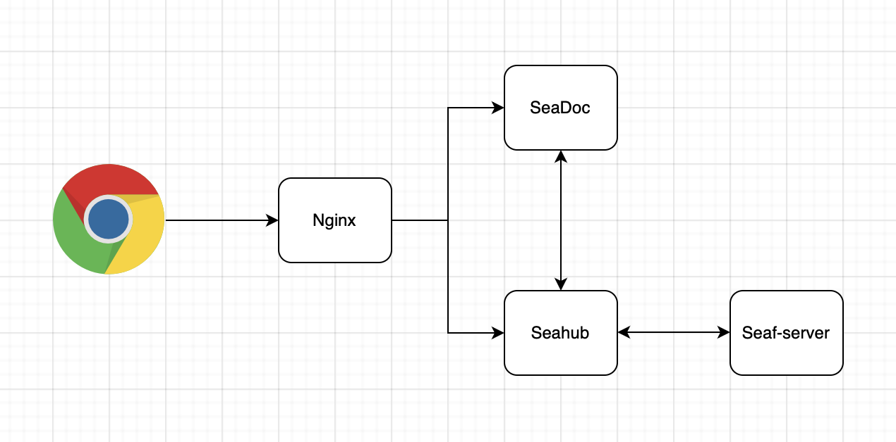

# SeaDoc Integration

SeaDoc is an extension of Seafile that providing an online collaborative document editor.

SeaDoc designed around the following key ideas:

* An expressive easy to use editor
* A review and approval workflow to better control how contents changes
* Inter-document linking for connecting related contents
* AI integration that streamlines content generation, summarization, and management
* Comprehensive APIs for automating document generating and processing

SeaDoc excels at:

* Authoring product and technical documents
* Creating knowledge base articles and online manuals
* Building internal Wikis

## Architecture

The SeaDoc archticture is demonstrated as below:



Here is the workflow when a user open sdoc file in browser

1. When a user open a sdoc file in the browser, a file loading request will be sent to Caddy, and Caddy proxy the request to SeaDoc server (see [Seafile instance archticture](../docker/seafile_docker_overview.md) for the details).
2. SeaDoc server will send the content back if it is already cached, otherwise it sends a request to Seahub.
3. Seahub loads the content from Seafile-server, then sends it to SeaDoc server and write the file to the cache at the same time.
4. After SeaDoc receives the content, it sends the content to the browser.

## Setup SeaDoc

> Seafile version 11.0 or later is required to work with SeaDoc.

### Deployment method

SeaDoc has the following deployment methods:

- Deploy SeaDoc on a new host.
- SeaDoc and Seafile docker are deployed on the same host.

### Deploy SeaDoc on a new host

#### Download and modify SeaDoc docker-compose.yml

Download [docker-compose.yml](https://manual.seafile.com/docker/docker-compose/seadoc/0.8/docker-compose.yml) sample file to your host. Then modify the file according to your environment. The following fields are needed to be modified:

- `DB_HOST`: MySQL host
- `DB_PORT`: MySQL port
- `DB_USER`: MySQL user
- `DB_PASSWD`: MySQL password
- `volumes`: The volume directory of SeaDoc data
- `SDOC_SERVER_HOSTNAME`: SeaDoc service URL
- `SEAHUB_SERVICE_URL`: Seafile service URL

#### Create the SeaDoc database manually

SeaDoc and Seafile share the MySQL service.

Create the database sdoc_db in Seafile MySQL and authorize the user.

```sh
create database if not exists sdoc_db charset utf8mb4;
GRANT ALL PRIVILEGES ON `sdoc_db`.* to `seafile`@`%.%.%.%`;
```

Note, SeaDoc will only create one database table to store operation logs.

Then follow the section: Start SeaDoc.

### SeaDoc and Seafile docker are deployed on the same host

#### Download the seadoc.yml and integrate SeaDoc in Seafile docker

```shell
# for community edition
wget https://manual.seafile.com/docker/docker-compose/ce/12.0/seadoc.yml

# for pro edition
wget https://manual.seafile.com/docker/docker-compose/pro/12.0/seadoc.yml
```

Modify `.env`, and insert `seadoc.yml` into `COMPOSE_FILE`, and enable SeaDoc server

```shell
COMPOSE_FILE='seafile-server.yml,caddy.yml,seadoc.yml'

ENABLE_SEADOC=false
SEADOC_SERVER_URL=http://example.seafile.com/sdoc-server
```

#### Create the SeaDoc database manually

SeaDoc and Seafile share the MySQL service.

Create the database sdoc_db in Seafile MySQL.

```sh
create database if not exists sdoc_db charset utf8mb4;
GRANT ALL PRIVILEGES ON `sdoc_db`.* to `seafile`@`%.%.%.%`;
```

Note, SeaDoc will only create one database table to store operation logs.

## Start SeaDoc

Start SeaDoc server with the following command

```sh
docker compose up -d
```

Now you can use SeaDoc!

## SeaDoc directory structure

### `/opt/seadoc-data`

Placeholder spot for shared volumes. You may elect to store certain persistent information outside of a container, in our case we keep various log files and upload directory outside. This allows you to rebuild containers easily without losing important information.

* /opt/seadoc-data/sdoc-server: This is the directory for SeaDoc server configuration and data.
* /opt/seadoc-data/nginx-logs: This is the directory for nginx logs.
* /opt/seadoc-data/ssl: This is directory for certificate, which does not exist by default.

## FAQ

### About SSL

From Seafile 12.0, the SSL is handled by [***Caddy***](https://caddyserver.com/docs/). Caddy is a modern open source web server that mainly binds external traffic and internal services in [seafile docker](./seafile_docker_structures.md). The default caddy image is [`lucaslorentz/caddy-docker-proxy:2.9`](https://github.com/lucaslorentz/caddy-docker-proxy), which user only needs to correctly configure the following fields in `.env` to automatically complete the acquisition and update of the certificate:

```shell
SEAFILE_SERVER_PROTOCOL=https
SEAFILE_SERVER_HOSTNAME=example.com
```
