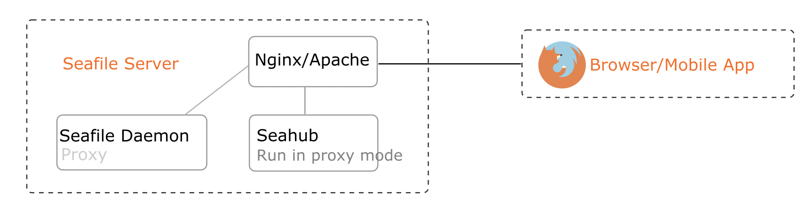

# Components Overview

Seafile server consists of following components:

- **Seahub** (django)：the web frontend. Seafile server package contains a light-weight Python HTTP server gunicorn that serves the website. By default, Seahub runs as an application within gunicorn. You can also configure Seahub to run under WSGI mode behind Nginx or Apache. This is recommended for production setups.
- **Seafile server** (``seaf-server``)：data service daemon, handles raw file upload, download and synchronization. Seafile server by default listens on port 8082. You can configure Nginx/Apache to proxy traffic to the local 8082 port.
- **Ccnet server** (``ccnet-server``)： RPC service daemon to enable communication among multiple components. Ccnet is only used for internal communication.

The picture below shows how Seafile clients access files when you configure Seafile behind Nginx/Apache.

- All access to the Seafile service (including Seahub and Seafile server) can be configured behind Nginx or Apache web server. This way all network traffic to the service can be encrypted with HTTPS.
- When user accesses Seahub, Seahub accesses data from Seafile server using Ccnet RPC.
