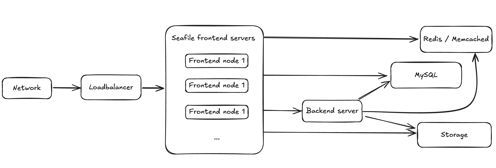

# Seafile Docker Cluster Deployment

## Architecture

The Seafile cluster solution employs a 3-tier architecture:

* Load balancer tier: Distribute incoming traffic to Seafile servers. HA can be achieved by deploying multiple load balancer instances.
* Seafile server cluster: a cluster of Seafile server instances. If one instance fails, the load balancer will stop handing traffic to it. So HA is achieved.
* Backend storage: Distributed storage cluster, e.g.  S3, Openstack Swift or Ceph.

This architecture scales horizontally. That means, you can handle more traffic by adding more machines. The architecture is visualized in the following picture.



There are two main components on the Seafile server node: web server (Nginx/Apache) and Seafile app server. The web server passes requests from the clients to Seafile app server. The Seafile app servers work independently. They don't know about each other's state. That means each app server can fail independently without affecting other app server instances. The load balancer is responsible for detecting failure and re-routing requests.

Even though Seafile app servers work independently, they still have to share some session information. All shared session information is stored in memory cache. Thus, all Seafile app servers have to connect to the same memory cache server (cluster). Since Pro Edition 11.0, both memcached and Redis can be used as memory cache. Before 11.0, only memcached is supported. More details about memory cache configuration is available later.

The background server is the workhorse for various background tasks, including full-text indexing, office file preview, virus scanning, LDAP syncing. It should usually be run on a dedicated server for better performance. Currently only one background task server can be running in the entire cluster. If more than one background servers are running, they may conflict with each others when doing some tasks. If you need HA for background task server, you can consider using [Keepalived](http://www.keepalived.org/) to build a hot backup for it.

In the seafile cluster, **only one server** should run the background tasks, including:

* indexing files for search
* email notification
* LDAP sync
* virus scan

Let's assume you have three nodes in your cluster: A, B, and C.

* Node A is backend node that run background tasks.
* Node B and C are frontend nodes that serving requests from clients.


## Cluster requirements

Please refer [here](./system_requirements.md#seafile-cluster) for the details about the cluster requirements for **all nodes** in Seafile cluster.  In general, we recommend that each node should have at least 2G RAM and a 2-core CPU (> 2GHz).

## Deploy Seafile service

### Deploy the first Seafile frontend node

1. Create the mount directory

    ```sh
    mkdir -p /opt/seafile/shared
    ```

2. Pulling Seafile image

    !!! tip
        Since v12.0, Seafile PE versions are hosted on DockerHub and does not require username and password to download.

    ```bash
    docker pull seafileltd/seafile-pro-mc:13.0-latest
    ```

3. Download the `seafile-server.yml` and `.env`

    ```sh
    wget -O .env https://manual.seafile.com/13.0/repo/docker/cluster/env
    wget https://manual.seafile.com/13.0/repo/docker/cluster/seafile-server.yml
    ```

4. Modify the [variables](../config/env.md) in `.env` (especially the terms like `<...>`). 

    !!! tip
        If you have already deployed S3 storage backend and plan to apply it to Seafile cluster, you can modify the variables in `.env` to [set them synchronously during initialization](../config/env.md#s3-storage-backend-configurations-only-valid-in-pro-edition-at-deploying-first-time).

5. Pleace license file

    If you have a `seafile-license.txt` license file, simply put it in the volume of the Seafile container. The volumne's default path in the Compose file is `/opt/seafile/shared`. If you have modified the path, save the license file under your custom path.

    !!! danger "If the license file has a different name or cannot be read, Seafile server will start with in trailer mode with most THREE users"
    
6. Start the Seafile docker

    ```sh
    docker compose up -d
    ```

    !!! success "Cluster init mode"
    
        Because CLUSTER_INIT_MODE is true in the `.env` file, Seafile docker will be started in init mode and generate configuration files. As the results, you can see the following lines if you trace the Seafile container (i.e., `docker logs seafile`):

        ```log
        ---------------------------------
        This is your configuration
        ---------------------------------
        
            server name:            seafile
            server ip/domain:       seafile.example.com
        
            seafile data dir:       /opt/seafile/seafile-data
            fileserver port:        8082
        
            database:               create new
            ccnet database:         ccnet_db
            seafile database:       seafile_db
            seahub database:        seahub_db
            database user:          seafile
        
        
        Generating seafile configuration ...
        
        done
        Generating seahub configuration ...
        
        
        -----------------------------------------------------------------
        Your seafile server configuration has been finished successfully.
        -----------------------------------------------------------------
        
        
        [2024-11-21 02:22:37] Updating version stamp
        Start init
        
        Init success
        
        ```

7. In initialization mode, the service will not be started. During this time you can check the generated configuration files (e.g., MySQL, Memcached, Elasticsearch) in configuration files:

    - [seafevents.conf](../config/seafevents-conf.md)
    - [seafile.conf](../config/seafile-conf.md)
    - [seahub_settings.py](../config/seahub_settings_py.md)

8. After initailizing the cluster, the following fields can be removed in `.env`
    - `CLUSTER_INIT_MODE`, must be removed from .env file
    - `CLUSTER_INIT_MEMCACHED_HOST`
    - `CLUSTER_INIT_ES_HOST`
    - `CLUSTER_INIT_ES_PORT`
    - `INIT_S3_STORAGE_BACKEND_CONFIG`
    - `INIT_S3_COMMIT_BUCKET`
    - `INIT_S3_FS_BUCKET`
    - `INIT_S3_BLOCK_BUCKET`
    - `INIT_S3_KEY_ID`
    - `INIT_S3_SECRET_KEY`

    !!! tip
        We recommend that you check that the relevant configuration files are correct and copy the `SEAFILE_VOLUME` directory before the service is officially started, because only the configuration files are generated after initialization. You can directly migrate the entire copied `SEAFILE_VOLUME` to other nodes later:

        ```sh
        cp -r /opt/seafile/shared /opt/seafile/shared-bak
        ```

9. Restart the container to start the service in frontend node

    ```sh
    docker compose down
    docker compose up -d
    ```

    !!! success "Frontend node starts successfully"

        After executing the above command, you can trace the logs of container `seafile` (i.e., `docker logs seafile`). You can see the following message if the frontend node starts successfully:

        ```logs
        *** Running /etc/my_init.d/01_create_data_links.sh...
        *** Booting runit daemon...
        *** Runit started as PID 20
        *** Running /scripts/enterpoint.sh...
        2024-11-21 03:02:35 Nginx ready 

        2024-11-21 03:02:35 This is an idle script (infinite loop) to keep container running. 
        ---------------------------------

        Seafile cluster frontend mode

        ---------------------------------


        Starting seafile server, please wait ...
        Seafile server started

        Done.

        Starting seahub at port 8000 ...

        Seahub is started

        Done.
        ```

### Deploy the others Seafile frontend nodes

1. Create the mount directory

    ```
    $ mkdir -p /opt/seafile/shared

    ```

2. Pull Seafile image

3. Copy `seafile-server.yml`, `.env `and configuration files from the first frontend node

4. Start the service

    ```sh
    docker compose up -d
    ```

### Deploy seafile backend node

1. Create the mount directory

    ```
    $ mkdir -p /opt/seafile/shared

    ```

2. Pull Seafile image

3. Copy `seafile-server.yml`, `.env` and configuration files from frontend node

    !!! note
        The configuration files from frontend node have to be put in the same path as the frontend node, i.e., `/opt/seafile/shared/seafile/conf/*`

4. Modify `.env`, set `CLUSTER_MODE` to `backend`

5. Start the service in the backend node

    ```sh
    docker compose up -d
    ```

    !!! success "Backend node starts successfully"

        After executing the above command, you can trace the logs of container `seafile` (i.e., `docker logs seafile`). You can see the following message if the backend node starts successfully:

        ```logs
        *** Running /etc/my_init.d/01_create_data_links.sh...
        *** Booting runit daemon...
        *** Runit started as PID 21
        *** Running /scripts/enterpoint.sh...
        2024-11-21 03:11:59 Nginx ready 
        2024-11-21 03:11:59 This is an idle script (infinite loop) to keep container running. 

        ---------------------------------

        Seafile cluster backend mode

        ---------------------------------


        Starting seafile server, please wait ...
        Seafile server started

        Done.

        Starting seafile background tasks ...
        Done.
        ```
 
## Deploy load balance (Optional)

!!! note
    Since Seafile Pro server 6.0.0, cluster deployment requires "sticky session" settings in the load balancer. Otherwise sometimes folder download on the web UI can't work properly. Read the "Load Balancer Setting" section below for details

Generally speaking, in order to better access the Seafile service, we recommend that you use a load balancing service to access the Seafile cluster and bind your domain name (such as `seafile.cluster.com`) to the load balancing service. Usually, you can use:

- Cloud service provider's load balancing service (e.g., ***AWS Elastic Load Balancer***)
- Deploy your own load balancing service, our document will give two of common load balance services:

    - ***Nginx***
    - ***HAproxy***

### AWS Elastic Load Balancer (ELB)

In the AWS ELB management console, after you've added the Seafile server instances to the instance list, you should do two more configurations.

First you should setup HTTP(S) listeners. Ports 443 and 80 of ELB should be forwarded to the ports 80 or 443 of the Seafile servers.

Then you setup health check


Refer to [AWS documentation](http://docs.aws.amazon.com/elasticloadbalancing/latest/classic/elb-sticky-sessions.html) about how to setup sticky sessions.


### Nginx

1. Install Nginx in the host if you would like to deploy load balance service

    ```sh
    sudo apt update
    sudo apt install nginx
    ```

2. Create the configurations file for Seafile cluster

    ```sh
    sudo nano /etc/nginx/sites-available/seafile-cluster
    ```

    and, add the following contents into this file:

    ```nginx
    upstream seafile_cluster {
        server <IP: your frontend node 1>:80;
        server <IP: your frontend node 2>:80;
        ...
    }

    server {
        listen 80;
        server_name <your domain>;

        location / {
            proxy_pass http://seafile_cluster;
            proxy_set_header Host $host;
            proxy_set_header X-Real-IP $remote_addr;
            proxy_set_header X-Forwarded-For $proxy_add_x_forwarded_for;
            proxy_set_header X-Forwarded-Proto $scheme;
            http_502 http_503 http_504;
        }
    }
    ```

3. Link the configurations file to `sites-enabled` directory:

    ```sh
    sudo ln -s /etc/nginx/sites-available/seafile-cluster /etc/nginx/sites-enabled/
    ```

4. Test and enable configuration

    ```sh
    sudo nginx -t
    sudo nginx -s reload
    ```

### HAproxy and Keepalived services

Execute the following commands on the two Seafile frontend servers:

```
$ apt install haproxy keepalived -y

$ mv /etc/haproxy/haproxy.cfg /etc/haproxy/haproxy.cfg.bak

$ cat > /etc/haproxy/haproxy.cfg << 'EOF'
global
    log 127.0.0.1 local1 notice
    maxconn 4096
    user haproxy
    group haproxy

defaults
    log global
    mode http
    retries 3
    timeout connect 10000
    timeout client 300000
    timeout server 36000000

listen seafile 0.0.0.0:80
    mode http
    option httplog
    option dontlognull
    option forwardfor
    cookie SERVERID insert indirect nocache
    server seafile01 Front-End01-IP:8001 check port 11001 cookie seafile01
    server seafile02 Front-End02-IP:8001 check port 11001 cookie seafile02
EOF

```

!!! warning
    Please **correctly** modify the IP address (`Front-End01-IP` and `Front-End02-IP`) of the frontend server in the above configuration file. Other wise it cannot work properly.

**Choose one of the above two servers as the master node, and the other as the slave node.**

Perform the following operations on the master node:

```bash
$ cat > /etc/keepalived/keepalived.conf << 'EOF'
! Configuration File for keepalived

global_defs {
    notification_email {
        root@localhost
    }
    notification_email_from keepalived@localhost
    smtp_server 127.0.0.1
    smtp_connect_timeout 30
    router_id node1
    vrrp_mcast_group4 224.0.100.18
}

vrrp_instance VI_1 {
    state MASTER
    interface eno1   # Set to the device name of a valid network interface on the current server, and the virtual IP will be bound to the network interface
    virtual_router_id 50
    priority 100
    advert_int 1
    authentication {
        auth_type PASS
        auth_pass seafile123
    }
    virtual_ipaddress {
        172.26.154.45/24 dev eno1  # Configure to the correct virtual IP and network interface device name
    }
}
EOF

```

!!! warning
    Please **correctly** configure the virtual IP address and network interface device name in the above file. Other wise it cannot work properly.

Perform the following operations on the standby node:

```bash
$ cat > /etc/keepalived/keepalived.conf << 'EOF'
! Configuration File for keepalived

global_defs {
    notification_email {
        root@localhost
    }
    notification_email_from keepalived@localhost
    smtp_server 127.0.0.1
    smtp_connect_timeout 30
    router_id node2
    vrrp_mcast_group4 224.0.100.18
}

vrrp_instance VI_1 {
    state BACKUP
    interface eno1   # Set to the device name of a valid network interface on the current server, and the virtual IP will be bound to the network interface
    virtual_router_id 50
    priority 98
    advert_int 1
    authentication {
        auth_type PASS
        auth_pass seafile123
    }
    virtual_ipaddress {
        172.26.154.45/24 dev eno1   # Configure to the correct virtual IP and network interface device name
    }
}
EOF

```

Finally, run the following commands on the two Seafile frontend servers to start the corresponding services:

```
$ systemctl enable --now haproxy
$ systemctl enable --now keepalived

```

So far, Seafile cluster has been deployed.

## HTTPS

You can engaged HTTPS in your load balance service, as you can use certificates manager (e.g., [Certbot](https://certbot.eff.org)) to acquire and enable HTTPS to your Seafile cluster. You have to modify the relative URLs from the prefix `http://` to `https://` in `seahub_settings.py` and `.env`, after enabling HTTPS.

## (Optional) Deploy SeaDoc server

You can follow [here](../extension/setup_seadoc.md) to deploy SeaDoc server. And then modify `SEADOC_SERVER_URL` in your `.env` file
