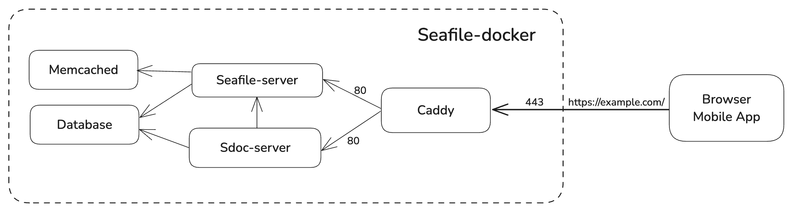

# Seafile Docker overview

Seafile docker based installation consist of the following components (docker images):

- Seafile server: Seafile core services, see [Seafile Components](../introduction/components.md) for the details.
- Sdoc server: SeaDoc server, provide a lightweight online collaborative document editor, see [SeaDoc](../extension/extra_components/setup_seadoc.md#architecture) for the details.
- Database: Stores data related to Seafile and SeaDoc.
- Memcached: Cache server.
- Caddy: Caddy server enables user to access the Seafile service (i.e., Seafile server and Sdoc server) externally and handles `SSL` configuration

