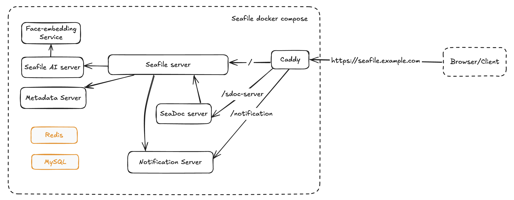

# Seafile Docker overview

Seafile docker based installation consist of the following components (docker images):

- Seafile server: Seafile core services, see [Seafile Components](../introduction/components.md) for the details.
- MySQL: Database stores data related to Seafile and SeaDoc.
- Redis: Cache server.
- Caddy: Caddy server enables user to access the Seafile service (i.e., Seafile server and Sdoc server) externally and handles `SSL` configuration.
- Seafile optional extension:
    - [SeaDoc Server](../extension/setup_seadoc.md#architecture): SeaDoc server, provide a lightweight online collaborative document editor,.
    - [Notification Server](../extension/notification-server.md): Notify clients of updates to the repository status.
    - [Metadata Server](../extension/metadata-server.md): Provide metadata management for your libraries.
    - [Seafile AI & face embedding](../extension/seafile-ai.md): Users can enable Seafile AI to support features such as file tags, file and image summaries, text translation, sdoc writing assistance, generating image tags (including objects, weather, color, etc.), face detection and encoding in images, and text detection in images (OCR).

## Document guidelines

### Single Node deployment
- Deploy from Docker image:
    - [Seafile CE](./setup_ce_by_docker.md)
    - [Seafile Pro](./setup_pro_by_docker.md)
- Deploy from Kubernetes (K8S) with [*Docker-cri*](https://mirantis.github.io/cri-dockerd/usage/install/):
    - Deploy by [Seafile Helm Chart](./helm_chart_single_node.md)
    - Deploy by [Seafile K8S resources files](./k8s_single_node.md)

### Cluster (Pro only)
- Deploy from [Docker](./cluster_deploy_with_docker.md)
- Deploy from Kubernetes (K8S) with [*Docker-cri*](https://mirantis.github.io/cri-dockerd/usage/install/):
    - Deploy by [Seafile Helm Chart](./helm_chart_cluster.md)
    - Deploy by [Seafile K8S resources files](./cluster_deploy_with_k8s.md)